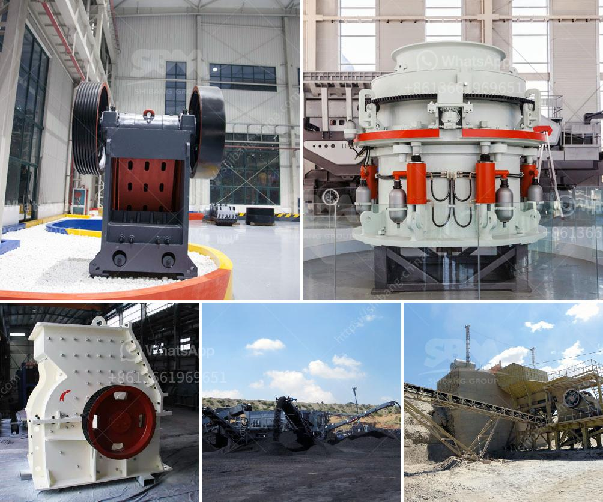

<h3>mobile gold processing 20 tph</h3>
In recent years, the global mining industry has witnessed a paradigm shift towards sustainable and environmentally-friendly practices. This has led to a surge in interest in small-scale and artisanal mining operations. One such innovation that is revolutionizing the concept of mining is mobile gold processing.

Mobile gold processing plants are compact, efficient, and cost-effective systems that are designed to process gold ore on a small scale. These plants are portable and can be easily relocated to remote locations, ensuring that miners can access them with ease. Being mobile also reduces the need for large infrastructure investments, making it a viable option for small-scale miners with limited resources.

One of the key advantages of mobile gold processing plants is their ability to process ores of varying grades and compositions. These plants utilize advanced technologies such as gravity concentration, leaching, and carbon-in-pulp (CIP) techniques to extract gold from ore. By employing sophisticated equipment and methodologies, these plants can recover up to 95% of gold from ore, minimizing waste and maximizing profits.

Another crucial aspect of mobile gold processing plants is their low environmental footprint. With the use of eco-friendly reagents and the implementation of closed-loop systems, these plants greatly reduce the release of harmful substances into the environment. This contributes to the overall sustainability of the mining operation and ensures that the local ecosystem remains protected.

Mobile gold processing plants can be customized to suit various mining scenarios. They are available in different capacities, with a range of 20 TPH being a popular choice among small-scale miners. This capacity allows for effective and efficient processing of gold ore while also catering to the specific needs and requirements of individual mining operations.

In a world that increasingly values sustainability and responsible mining practices, mobile gold processing plants are proving to be a game-changer for small-scale mining operations. By providing efficient and cost-effective processing solutions, these plants offer a pathway towards sustainable growth and development for the mining industry.

In conclusion, mobile gold processing plants offer an innovative and sustainable solution for small-scale mining operations. With their compact design, advanced technologies, and low environmental footprint, these plants ensure efficient and responsible processing of gold ore. As the mining industry continues to evolve, mobile gold processing plants are poised to play a crucial role in transforming the way small-scale miners operate and contribute to the global supply of gold.
<h3>Contact us</h3><ul><li><strong>Whatsapp:&nbsp;<a href="https://wa.me/8613661969651">+8613661969651</a></strong></li><li><a href="https://swt.shibang-china.com/?git&amp;zhl&amp;mobile gold processing 20 tph"><strong>Online Service(chat now)</strong></a></li></ul><h3>Related</h3><ul><li><a href='graphite processing plant.md'>graphite processing plant</a></li><li><a href='mtm trapezium mill.md'>mtm trapezium mill</a></li><li><a href='jaw crusher suppliers in mexico.md'>jaw crusher suppliers in mexico</a></li><li><a href='limestone production plant.md'>limestone production plant</a></li><li><a href='micron grinding mill nigeria.md'>micron grinding mill nigeria</a></li></ul>