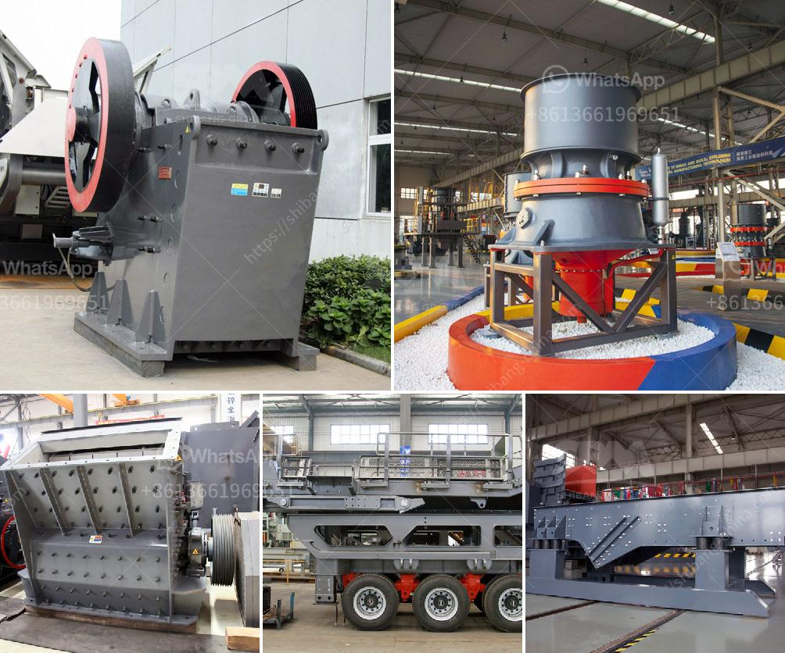

<h3>mobile hammer crusher</h3>
Mobile hammer crusher is a type of crusher that is utilised in the industry for crushing and breaking rocks and other hard materials. This machine is mostly used in quarries, mines, building materials, highways, railways, water conservancy and chemical industries. The main objective of a mobile hammer crusher is to crush materials to smaller sizes for further processing or utilization.

One of the noteworthy advantages of a mobile hammer crusher is its portability. This equipment can be easily moved from one location to another, allowing operators to crush materials in different areas or on-site. This flexibility not only saves transportation costs but also enables efficient crushing operations in various environments.

The mobile hammer crusher is equipped with a powerful and efficient motor that drives the rotor to rotate at high speed. The materials are fed into the crushing chamber through the feed hopper, and the impact of the hammers against the materials causes them to be crushed and fragmented. The crushed materials then exit the crusher through the discharge opening.

Another significant feature of a mobile hammer crusher is its adjustable discharge size. Operators can easily adjust the clearance between the hammers and the impact plates to control the final product's size. This allows for the production of different sizes of crushed materials, catering to the specific requirements of various applications.

Furthermore, the mobile hammer crusher is designed with safety in mind. It is equipped with safety guards and an enclosed structure that reduces the risk of accidents or injuries to operators. Additionally, advanced technology is employed to monitor the operational status of the machine, ensuring safe and efficient crushing operations.

In conclusion, a mobile hammer crusher is a versatile and invaluable equipment in the crushing and processing industry. Its portability, adjustable discharge size, and safety features make it an ideal choice for various applications. Whether in mining, quarrying, or construction, a mobile hammer crusher proves to be an efficient and reliable solution for breaking rocks and hard materials.
<h3>Contact us</h3><ul><li><strong>Whatsapp:&nbsp;<a href="https://wa.me/8613661969651">+8613661969651</a></strong></li><li><a href="https://swt.shibang-china.com/?git&amp;zhl&amp;mobile hammer crusher"><strong>Online Service(chat now)</strong></a></li></ul><h3>Related</h3><ul><li><a href='hard rock ball mill specs.md'>hard rock ball mill specs</a></li><li><a href='3 4 inch crushed limestone.md'>3 4 inch crushed limestone</a></li><li><a href='salt machinery manufacturers india price.md'>salt machinery manufacturers india price</a></li><li><a href='crusher production line.md'>crusher production line</a></li><li><a href='msme ball mill project report.md'>msme ball mill project report</a></li></ul>