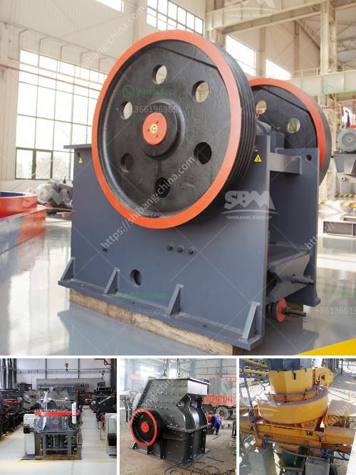

<h3>mobile jaw crusher dealers south africa</h3>
Mobile jaw crushers are renowned worldwide for their versatility, efficiency, and productivity. These machines, built to crush the hardest of materials, are ideal for producers in need of high-quality aggregates, road base, or demolition materials. In South Africa, mobile jaw crushers are well-known for their excellent performance in quarrying, mining, construction, and recycling industries.

With numerous models available from different leading brands, mobile jaw crushers South Africa dealerships present an abundance of options for customers to choose from. With such a wide selection, finding the perfect machine to suit specific needs can be a daunting task. However, the advantages of purchasing these machines from authorized dealerships cannot be overstated.

One of the key benefits of buying mobile jaw crushers in South Africa from authorized dealerships is access to comprehensive after-sales support. Authorized dealerships have a team of expert technicians who are trained to handle any technical issue that may arise during the operation or maintenance of the machines. They have the knowledge and expertise to troubleshoot problems effectively and provide quick and efficient solutions, thereby minimizing downtime and ensuring maximum productivity.

Another advantage of purchasing mobile jaw crushers from authorized dealerships is the availability of genuine spare parts. These machines consist of various components that may require replacement due to wear and tear or damage. Authorized dealerships stock genuine spare parts that are specifically designed for the machines they sell. Using genuine spare parts ensures the durability and longevity of the machines, thereby maximizing their performance and reducing the frequency and cost of repairs.

Additionally, authorized dealerships offer warranties on mobile jaw crushers, providing customers with peace of mind and protection against any unforeseen issues that may arise shortly after the purchase. Warranties cover both parts and labor, allowing customers to receive prompt and reliable service in case of any defects or malfunctions in the machines.

Furthermore, authorized dealerships often offer flexible financing options to customers, making it easier for them to acquire mobile jaw crushers without straining their finances. These dealerships work closely with financial institutions to provide competitive and customized financing solutions, ensuring that customers can choose a payment plan that suits their budget and requirements.

When considering purchasing mobile jaw crushers in South Africa, it is important to conduct thorough research in order to identify authorized dealerships. The reputation, experience, and customer reviews of the dealership should be taken into account to ascertain their reliability and customer satisfaction levels.

To summarize, mobile jaw crushers are indispensable machines in various industries, and South Africa offers an extensive range of options through authorized dealerships. These dealerships not only provide access to a wide selection of machines but also offer comprehensive after-sales support, genuine spare parts, warranties, and flexible financing options. By purchasing mobile jaw crushers from authorized dealerships, customers can ensure maximum productivity, efficiency, and longevity of their machines, ultimately driving their businesses towards success.
<h3>Contact us</h3><ul><li><strong>Whatsapp:&nbsp;<a href="https://wa.me/8613661969651">+8613661969651</a></strong></li><li><a href="https://swt.shibang-china.com/?git&amp;zhl&amp;mobile jaw crusher dealers south africa"><strong>Online Service(chat now)</strong></a></li></ul><h3>Related</h3><ul><li><a href='aggregate crushing machine portable.md'>aggregate crushing machine portable</a></li><li><a href='sell stone crusher 2x4.md'>sell stone crusher 2x4</a></li><li><a href='mobile crusher rent uae.md'>mobile crusher rent uae</a></li><li><a href='dolomite powder machine in sri lanka.md'>dolomite powder machine in sri lanka</a></li><li><a href='process of quarrying limestone crusher.md'>process of quarrying limestone crusher</a></li></ul>