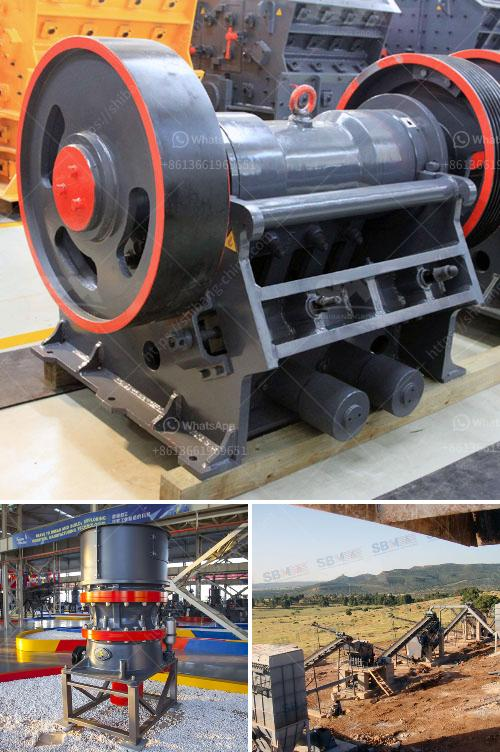

<h3>mobile quarry crushing plant price in jamaica</h3>
For most quarries, the objective is to produce aggregates for onward sale or captive use, crushing plants are integral to the quarrying process and have been introduced to improve productivity and reduce costs. Mobile quarry crushing plant is widely used in many industries, such as construction, building materials, road, railway, water conservancy and hydropower. The equipment is essential for mining and crushing plants. By choosing the most suitable crushing plant equipment, businesses can achieve significant cost savings.

In Jamaica, quarries produce substantial amounts of aggregates for the construction industry. Currently, quarries rely on mobile crushing plants, which are used for extracting and processing raw materials. Mobile crushing plants are heavy-duty machines that are mainly used to crush rocks and have revolutionized the whole industry. To meet the needs of customers, mobile crushing plants can adapt to various terrains, offer a wide range of configurations, and have excellent flexibility.

When it comes to the price of mobile quarry crushing plant in Jamaica, there is no fixed standard. The price of the plant varies depending on several factors. Generally, the cost of the plant includes the initial installation, transportation, and commissioning fees. Additionally, the capacity, type of crushers, location, and labor costs play a crucial role in determining the price. For instance, a larger crushing plant with higher capacity will cost more than a smaller one. Similarly, a plant located in a remote area may incur higher transportation expenses.

Despite these variations, it is important to highlight the cost-saving benefits of mobile quarry crushing plants. Firstly, mobile plants eliminate the need for expensive civil works, such as concrete foundations. As a result, the overall project cost is significantly reduced. Secondly, mobile plants are highly efficient and can produce high-quality aggregates. This ensures a higher return on investment for quarry owners. Lastly, mobile plants can be easily moved from one quarry location to another, enabling operators to exploit different sites without establishing new facilities.

In Jamaica, the demand for mobile quarry crushing plants is rapidly increasing due to the substantial growth in the construction sector. The government's focus on infrastructure development has further fueled the demand for aggregates. As a result, quarry owners are investing in mobile crushing plants to meet the rising demand and improve their overall operational efficiency. The low initial investment and long-term cost-saving benefits make mobile quarry crushing plants an attractive option for businesses in Jamaica.

To conclude, mobile quarry crushing plant prices in Jamaica are influenced by various factors including capacity, type of crushers, location, and labor costs. However, the cost-saving benefits associated with mobile plants make them a favorable choice for quarry owners. With their adaptability and efficient performance, mobile crushing plants are becoming an integral part of the quarrying industry in Jamaica. Operators can expect substantial cost savings, excellent flexibility, and improved productivity by investing in these plants.
<h3>Contact us</h3><ul><li><strong>Whatsapp:&nbsp;<a href="https://wa.me/8613661969651">+8613661969651</a></strong></li><li><a href="https://swt.shibang-china.com/?git&amp;zhl&amp;mobile quarry crushing plant price in jamaica"><strong>Online Service(chat now)</strong></a></li></ul><h3>Related</h3><ul><li><a href='hammer crusher mill.md'>hammer crusher mill</a></li><li><a href='crushing mill and impact mill.md'>crushing mill and impact mill</a></li><li><a href='stone crusher machine pr ice in nepal.md'>stone crusher machine pr ice in nepal</a></li><li><a href='malaysia hammer mills.md'>malaysia hammer mills</a></li><li><a href='price of grinder machine in india.md'>price of grinder machine in india</a></li></ul>