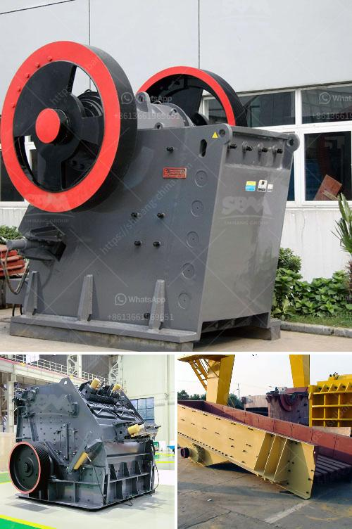

<h3>mobile screening plant for sale</h3>
Are you in the construction or mining industry and in need of a mobile screening plant? Look no further as we have the perfect solution for you. A mobile screening plant for sale is the ultimate equipment for any project that requires quick and efficient screening of materials. With the ability to move the plant to various locations on-site, it provides the flexibility and convenience needed to meet the demands of any project.

A mobile screening plant is a machine that sorts out materials of different sizes into separate piles. It is commonly used in construction, mining, and recycling industries to screen and separate a variety of materials such as rocks, dirt, gravel, and sand. By separating these materials, the plant ensures that only the desired size of material is used, which helps to improve the quality of the final product.

One of the greatest advantages of a mobile screening plant is its mobility. Unlike a stationary plant, a mobile plant can be easily moved from one location to another on-site. This allows for greater flexibility as it can be positioned closer to the material source, reducing transportation costs and increasing efficiency. Additionally, the plant can be relocated to different sites as needed, making it a cost-effective solution for projects that require screening in various locations.

Another benefit of a mobile screening plant is its ease of setup and operation. These plants are designed to be user-friendly, with simple controls and intuitive interfaces. This means that even operators with little experience can quickly learn how to operate the equipment efficiently. Furthermore, the plants are designed for easy maintenance, with accessible components and quick-change screens, reducing downtime and maximizing productivity.

When considering purchasing a mobile screening plant, it is important to assess your specific needs. Take into account the size and type of materials you will be screening, as well as the desired output size. Additionally, consider the production capacity required for your project and whether any additional features, such as a double-deck screen or a vibrating grid, are needed.

There are several companies that offer mobile screening plants for sale, each with their own unique features and specifications. Research different manufacturers to find the one that best suits your needs and budget. Don't hesitate to reach out to the manufacturer to ask questions or request a demonstration of the equipment.

In conclusion, a mobile screening plant for sale is a valuable asset for any construction or mining project. Its ability to quickly and efficiently screen materials of different sizes, along with its mobility and ease of setup, make it an essential piece of equipment. By investing in a mobile screening plant, you can enhance the quality and productivity of your project, ultimately leading to success.
<h3>Contact us</h3><ul><li><strong>Whatsapp:&nbsp;<a href="https://wa.me/8613661969651">+8613661969651</a></strong></li><li><a href="https://swt.shibang-china.com/?git&amp;zhl&amp;mobile screening plant for sale"><strong>Online Service(chat now)</strong></a></li></ul><h3>Related</h3><ul><li><a href='product japan crushing plant.md'>product japan crushing plant</a></li><li><a href='aggregate conveyor systems.md'>aggregate conveyor systems</a></li><li><a href='large volume conveyor belt systems rentals.md'>large volume conveyor belt systems rentals</a></li><li><a href='ball mill for sale manufacturers.md'>ball mill for sale manufacturers</a></li><li><a href='mobile jaw crusher dealers south africa.md'>mobile jaw crusher dealers south africa</a></li></ul>