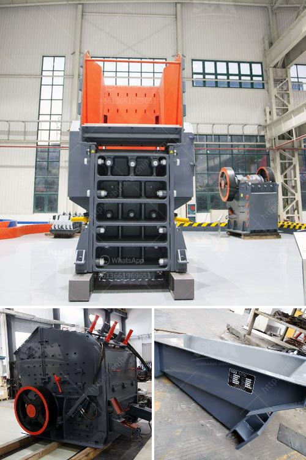

<h3>mobile stone crusher gauteng</h3>
Mobile stone crushers are a convenient and effective solution to enhance the efficiency and productivity of construction and mining projects in Gauteng. Providing the ultimate in versatility, they can handle a wide range of materials from hard and abrasive rocks to softer and more delicate substances.

Gauteng, a province in South Africa, is home to large-scale construction and mining activities. In these industries, efficient crushing and screening of materials is crucial to ensure maximum output and profitability. Mobile stone crushers prove to be an essential tool in addressing the demands of such projects.

One of the key advantages of mobile stone crushers is their portability. They can be easily transported to even the most remote areas, allowing contractors and miners to reach their job sites without any hassle. This flexibility enables them to be deployed quickly, minimizing downtime and increasing productivity.

Furthermore, mobile stone crushers are equipped with powerful engines that enable them to tackle even the toughest of tasks. They can effortlessly crush rocks of various sizes and hardness levels, making it possible to process a wide range of materials onsite. This eliminates the need for costly transportation of materials to and from the job site, resulting in significant cost savings.

Moreover, mobile stone crushers are highly maneuverable, thanks to their compact and lightweight design. They can navigate through narrow and difficult terrains, making them suitable for use in a variety of settings. Whether it's a construction site in a busy urban area or a mine in a remote location, mobile stone crushers can be easily transported and set up, allowing for quick and efficient operations.

In conclusion, mobile stone crushers have become an essential equipment in the construction and mining industry in Gauteng. Their versatility, portability, and power make them an ideal choice for crushing and screening materials onsite. With these machines, contractors and miners can enhance their productivity, reduce costs, and complete projects in a timely manner.
<h3>Contact us</h3><ul><li><strong>Whatsapp:&nbsp;<a href="https://wa.me/8613661969651">+8613661969651</a></strong></li><li><a href="https://swt.shibang-china.com/?git&amp;zhl&amp;mobile stone crusher gauteng"><strong>Online Service(chat now)</strong></a></li></ul><h3>Related</h3><ul><li><a href='ultrafine vertical roller mill.md'>ultrafine vertical roller mill</a></li><li><a href='manufacturers hammer mill manufacturers in malaysia.md'>manufacturers hammer mill manufacturers in malaysia</a></li><li><a href='gypsum processing machine price list.md'>gypsum processing machine price list</a></li><li><a href='cone crusher manufacturer.md'>cone crusher manufacturer</a></li><li><a href='portable crushers sweden.md'>portable crushers sweden</a></li></ul>