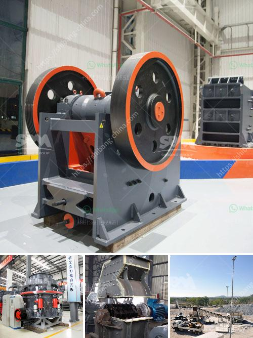

<h3>mobile stone crusher plant south africa</h3>
Mobile stone crusher plant is a crucial addition to any quarry or mining industry. It is equally important to choose the right type of equipment for your mining or construction operations. Although it may seem like a tedious task, researching and selecting the appropriate one will yield significant results. So, what is a mobile stone crusher plant, and why is it so essential to have in South Africa?

Mobile stone crusher plant: A mobile stone crusher plant is a valuable machine for construction mining operations and other similar industries. It consists of various innovative and efficient machines such as crushers, vibrating screeners, feeder, and belt conveyor. It is specifically designed to meet the challenging demands of quarrying and mining operations.

Why is it important in South Africa? South Africa is rich in mineral resources, making it a major player in the mining industry globally. It is crucial to have access to quality equipment that can reduce downtime and enhance productivity. A mobile stone crusher plant allows operators to maximize productivity while minimizing costs.

The mobile stone crusher plant can easily be transported at any time and is the ideal equipment choice for contractors working on remote sites. It also makes it easier for construction companies to perform crushing and screening operations in urban areas where access to quarries is limited.

Furthermore, the mobile stone crusher plant can be deployed on construction sites or in quarries for crushing and screening operations. This ensures that contractors can efficiently and effectively complete their projects, exceeding customer expectations.

In conclusion, investing in a mobile stone crusher plant is a wise choice for anyone who works in the mining or construction industry. The mobility and convenience provided by these machines eliminate the need for multiple crushing and screening plants, further streamlining operations and increasing productivity. Furthermore, they are cost-efficient and help in minimizing downtime, resulting in significant savings. So, if you are in South Africa and are looking for a mobile stone crusher plant, get in touch with one of the leading manufacturers in the industry today.
<h3>Contact us</h3><ul><li><strong>Whatsapp:&nbsp;<a href="https://wa.me/8613661969651">+8613661969651</a></strong></li><li><a href="https://swt.shibang-china.com/?git&amp;zhl&amp;mobile stone crusher plant south africa"><strong>Online Service(chat now)</strong></a></li></ul><h3>Related</h3><ul><li><a href='vrm and ball mill circulating load.md'>vrm and ball mill circulating load</a></li><li><a href='double roll crusher indonesia.md'>double roll crusher indonesia</a></li><li><a href='coal crushing machine in malaysia.md'>coal crushing machine in malaysia</a></li><li><a href='difference between horizontal milling machine.md'>difference between horizontal milling machine</a></li><li><a href='ball mill for sale in india.md'>ball mill for sale in india</a></li></ul>