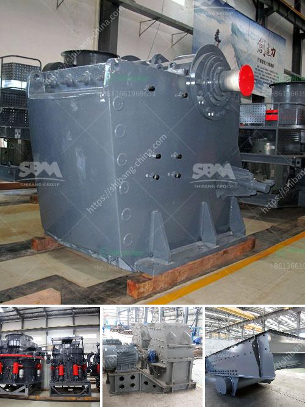

<h3>mobile stone crusher south africa</h3>
Mobile stone crusher is also known as portable stone crusher or mobile stone crushing plant. Mobile stone crusher is an integrated device that consists of vibrating feeder, stone crusher, vibrating screen, conveyor belt, and electric motor. It is mainly used for the processing of materials in smelting, chemical industry, production of building materials, power industry, etc.

Mobile stone crusher in South Africa can work independently or together with other devices according to coarse crushing or fine crushing requirements. Side discharging chute supports more screening and transporting ways. Diesel generators of the incorporated plant cannot only supply power for this mobile stone crusher, but also supply power for other plants of the process flow. It is a device with low energy consumption and high output, simple structure, easy installation, and straightforward maintenance.

Mobile stone crusher in South Africa has a wide application range, which can be used for primary crushing, secondary crushing, and tertiary crushing. For limestone production line, it can be used as a primary crusher. After crushing, crushed limestone aggregate can be used for concrete production. With the development of economy, more and more infrastructure construction is completed, increasing the demand for stone materials, which directly stimulates the growth of the stone crusher market.

Besides, the mobile stone crusher plant can also be used to process granite, limestone, basalt, andesite, quartz, pebble, copper ore, iron ore, etc. Its crawler-type and wheeled-type mobile stone crushers are adaptable to a variety of environments, allowing customers to choose the most suitable type of equipment according to their actual needs and site conditions.

To conclude, mobile stone crusher in South Africa has been widely used in construction, mining, metallurgical, chemical, coal, and other industries. It provides customers with simple, efficient, low-cost operation methods. It is welcomed by customers for its excellent performance, high efficiency, energy saving, environmental protection, and easy maintenance.
<h3>Contact us</h3><ul><li><strong>Whatsapp:&nbsp;<a href="https://wa.me/8613661969651">+8613661969651</a></strong></li><li><a href="https://swt.shibang-china.com/?git&amp;zhl&amp;mobile stone crusher south africa"><strong>Online Service(chat now)</strong></a></li></ul><h3>Related</h3><ul><li><a href='ball mill spares manufacturers in india.md'>ball mill spares manufacturers in india</a></li><li><a href='quarry crusher plant location in malaysia.md'>quarry crusher plant location in malaysia</a></li><li><a href='concrete crusher for sale in uae crusher.md'>concrete crusher for sale in uae crusher</a></li><li><a href='mobile crushing and screening to hire south africa.md'>mobile crushing and screening to hire south africa</a></li><li><a href='south africa second hand mobile stone crusher.md'>south africa second hand mobile stone crusher</a></li></ul>