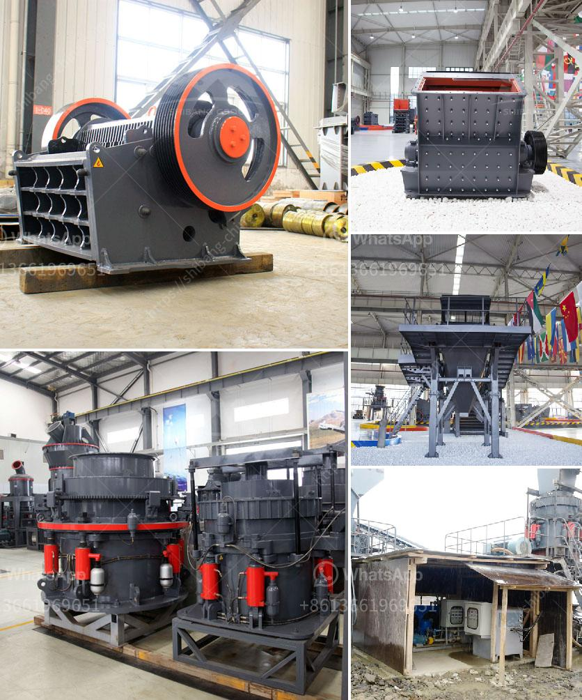

<h3>mobile stone crushers in usa</h3>
Mobile stone crushers are a crucial piece of equipment in various construction and mining industries. They come in different sizes and models to meet the specific needs of various operations. The versatile machines can be used as primary or secondary crushers in many applications, including road construction, sand and gravel production, construction waste recycling, and others.

In the United States, the demand for mobile stone crushers is high due to the increasing construction activities and infrastructure projects. This has resulted in a surge in the production of these crushers, making the market more competitive. The USA is one of the largest users of these machines and is experiencing significant growth in the industry.

Mobile stone crushers are a powerful tool for crushing stone or rock. The specifications, configuration, and price of different models vary, making it difficult for customers to choose the right one. To help in the decision-making process, here are some important factors to consider:

1. Mobility: One of the key advantages of mobile crushers is their mobility, allowing them to move from one site to another. Ensure that the machine you choose has the necessary features, such as track or wheel-mounted, to meet your specific needs.

2. Capacity: Consider the required capacity to determine the appropriate size and type of crusher. This will depend on the type and size of the material to be crushed.

3. Power source: Mobile stone crushers can be powered by diesel engines or electric motors. The choice of power source depends on factors such as availability, cost, and environmental considerations.

4. Maintenance and operating costs: It's important to evaluate the maintenance and operating costs of different models. Look for machines that are easy to maintain and have low fuel consumption to minimize overall costs.

5. Quality and reliability: Choose a reputed manufacturer known for producing high-quality and reliable crushers. Read customer reviews and check the warranty and after-sales service provided by the manufacturer.

Mobile stone crushers have revolutionized the construction industry by providing flexibility and efficiency in various operations. With the increasing demand for these crushers in the USA, manufacturers are striving to deliver innovative designs and technologies that enhance the productivity and ease of use for their customers. Whether used for primary or secondary crushing, these machines are sure to boost the efficiency and profitability of any construction or mining project.
<h3>Contact us</h3><ul><li><strong>Whatsapp:&nbsp;<a href="https://wa.me/8613661969651">+8613661969651</a></strong></li><li><a href="https://swt.shibang-china.com/?git&amp;zhl&amp;mobile stone crushers in usa"><strong>Online Service(chat now)</strong></a></li></ul><h3>Related</h3><ul><li><a href='mobile crusher price list.md'>mobile crusher price list</a></li><li><a href='wet ball milling.md'>wet ball milling</a></li><li><a href='brick crushers south africa.md'>brick crushers south africa</a></li><li><a href='costruire une machine pour broyer des briques.md'>costruire une machine pour broyer des briques</a></li><li><a href='cement industry processes.md'>cement industry processes</a></li></ul>