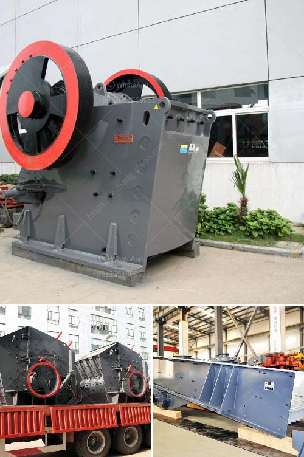

<h3>mobile stone crushing plant made in germany</h3>
Mobile stone crushing plant is a new type of crushing equipment, which expands the concept field of coarse crusher and fine crushering, it can suppy the customers the best crushing and screening solutions. Considering from the customers' standpoint, efficiently integrates the feeding equipment, crushing equipment, screening equipment, effectively solving the site constraints of the fixed crushing plants. The mobile stone crushing plant is widely applied in quarry, coal mining, construction waste recycling, earthwork, city infrastructure, road paving, building construction and so on.

With the increasing demands for more and better roads, railway construction and other infrastructure projects, the demand for construction materials is also increasing. Mobile stone crushing plant can crush the stones from smaller sizes to those required by construction projects, and this kind of crushing plant is very popular in Germany.

Mobile stone crushing plant project designer and manufacturer SBM is a leading Germany manufacturer and exporter of construction project designed and manufactured of fully mobile crushing and screening plants.

The mobile stone crusher plant is also called mobile crusher plant or the mobile construction station, which is mobile crushing equipment. SBM portable crushing plant concept is fully adaptable to all mobile crushing needs, it sets up a new range of business opportunities for contractors, quarry operators, recycling and mining applications. It can eliminate the obstacles of the crushing places and circumstances, and offer the high efficiency and low cost project plants for the client.

Overall, mobile stone crushing plant provides a new field of business opportunities for contractors, quarry operators, recycling and mining applications. It offers high efficient and low cost project plan without environment limit for the client. So, the mobile stone crushing plant is a promising future development method.
<h3>Contact us</h3><ul><li><strong>Whatsapp:&nbsp;<a href="https://wa.me/8613661969651">+8613661969651</a></strong></li><li><a href="https://swt.shibang-china.com/?git&amp;zhl&amp;mobile stone crushing plant made in germany"><strong>Online Service(chat now)</strong></a></li></ul><h3>Related</h3><ul><li><a href='limestone primary crushing plant.md'>limestone primary crushing plant</a></li><li><a href='diamond mining plant layout.md'>diamond mining plant layout</a></li><li><a href='conveyor belt capacity.md'>conveyor belt capacity</a></li><li><a href='limestone rock crushing company.md'>limestone rock crushing company</a></li><li><a href='blast furnace slag grinding machine india.md'>blast furnace slag grinding machine india</a></li></ul>