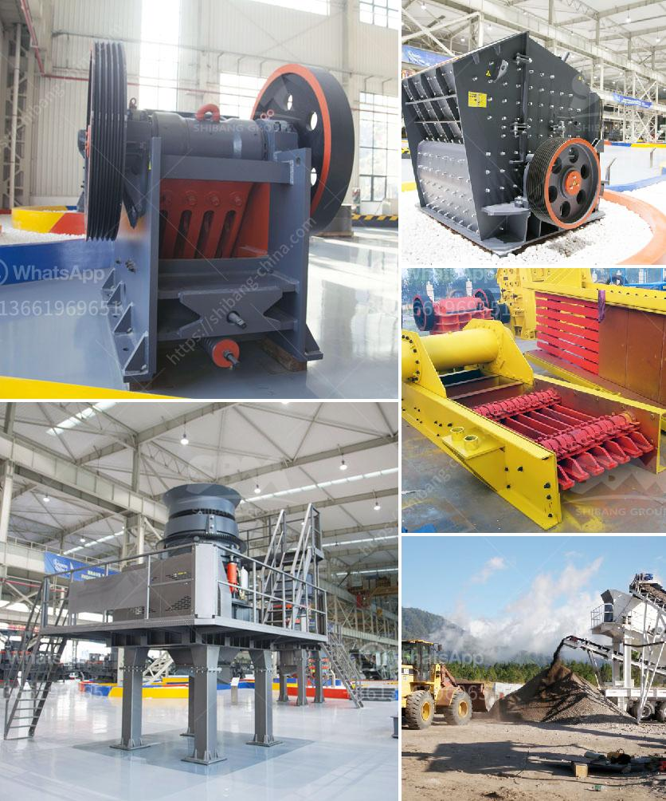

<h3>mobile stone crushing</h3>
Mobile stone crushing plants have been a popular option in recent times for quarry operators, recycling contractors, and mining applications. The portable stone crusher, which integrates the feeding, crushing, and conveying systems, can crush the large-size materials and have remarkable features such as high efficiency, low energy consumption, and strong adaptability to various environments.

The mobile stone crushing plant can be composed of two-stage plants or three-stage plants. The two-stage plants consist of a primary crushing system and a secondary crushing system, while the three-stage plants include primary crushing, secondary crushing, and tertiary crushing systems. These systems can work independently or in tandem, according to site requirements.

The main components of a mobile crushing plant include a vibrating feeder, a jaw crusher, a cone crusher, and a vibrating screen. It is equipped with a motor and a control box, making it highly flexible, reliable, and efficient in a variety of applications.

The mobile stone crushing plant can be used anywhere to break the raw material into small pieces. This is important for construction or public works projects that require a finely crushed stone. The machine can also be used in mining operations where removing the ore from the ground requires a mobile stone crusher.

Mobile stone crushers are also capable of crushing rocks of different sizes, depending on the requirement. If mine bosses are looking for better fragmentation, they should consider the use of mobile stone crushers. These machines enable operators to reach the desired level of fragmentation more efficiently, resulting in higher productivity and profitability.

Overall, mobile stone crushing plants deliver efficiency and flexibility compared to stationary crushing plants, guaranteeing shorter project development time and reducing relocation costs. These plants fulfill quarry operators' and mining companies' crushing requirements, perfectly adapting to different working environments and delivering optimum results.
<h3>Contact us</h3><ul><li><strong>Whatsapp:&nbsp;<a href="https://wa.me/8613661969651">+8613661969651</a></strong></li><li><a href="https://swt.shibang-china.com/?git&amp;zhl&amp;mobile stone crushing"><strong>Online Service(chat now)</strong></a></li></ul><h3>Related</h3><ul><li><a href='balast crashing machine dealers in uae.md'>balast crashing machine dealers in uae</a></li><li><a href='the world largest mobile crusher.md'>the world largest mobile crusher</a></li><li><a href='silica sand production line in german.md'>silica sand production line in german</a></li><li><a href='cone crusher details.md'>cone crusher details</a></li><li><a href='malaysia coconut grinder machine.md'>malaysia coconut grinder machine</a></li></ul>