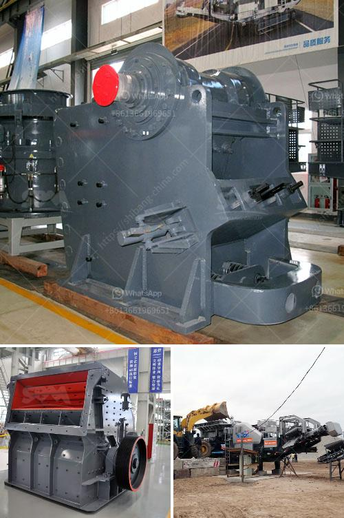

<h3>model pe 250 400 bantalan jaw crusher</h3>
The PE 250*400 jaw crusher is a versatile machine that utilizes advanced crushing technology. It is designed to crush various hard and abrasive stones, making it an essential piece of equipment for mining and quarry industries. The bantalan jaw crusher is known for its high efficiency and durability, making it a top choice for many professionals in the industry.

One of the key features of the PE 250*400 jaw crusher is its simplicity in design and operation. It has a sturdy structure that is easy to maintain, ensuring that the machine operates smoothly and efficiently for extended periods. The bantalan jaw crusher delivers optimal performance in terms of both crushing capacity and reduction ratio, making it suitable for various applications.

The bantalan jaw crusher also boasts a wide range of adjustable settings to control the size of the crushed material. This flexibility allows operators to produce different sizes of aggregates, enabling them to meet the specific requirements of their projects. Whether it is for road construction, building materials, or concrete production, the PE 250*400 jaw crusher delivers consistent performance and quality.

Another advantage of the bantalan jaw crusher is its energy efficiency. It is designed to minimize energy consumption without compromising on performance. This results in cost savings and reduced environmental impact, making it a sustainable choice for companies aiming to optimize their operations.

In conclusion, the PE 250*400 jaw crusher with a bantalan configuration is a reliable and efficient machine for crushing various hard and abrasive stones. Its simplicity, versatility, and energy efficiency make it a top choice for professionals in the mining and quarry industries. With its ability to produce different sizes of aggregates and its low maintenance requirements, it is a valuable asset for any operation.
<h3>Contact us</h3><ul><li><strong>Whatsapp:&nbsp;<a href="https://wa.me/8613661969651">+8613661969651</a></strong></li><li><a href="https://swt.shibang-china.com/?git&amp;zhl&amp;model pe 250 400 bantalan jaw crusher"><strong>Online Service(chat now)</strong></a></li></ul><h3>Related</h3><ul><li><a href='sand stone quarry mining.md'>sand stone quarry mining</a></li><li><a href='price of crusher sand in tons south africa.md'>price of crusher sand in tons south africa</a></li><li><a href='hard rock ball mill specs.md'>hard rock ball mill specs</a></li><li><a href='brick crushers south africa.md'>brick crushers south africa</a></li><li><a href='concrete stones crushing business plan.md'>concrete stones crushing business plan</a></li></ul>