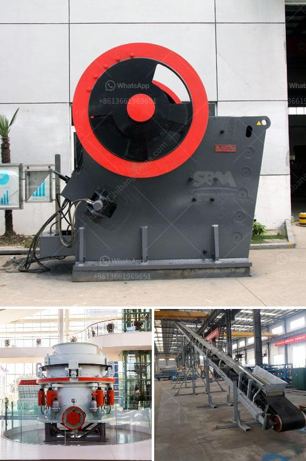

<h3>msme ball mill project report</h3>
The MSME (Micro, Small, and Medium Enterprises) sector is crucial for the growth and development of any economy. In India, this sector plays a significant role in generating employment opportunities, promoting entrepreneurship, and contributing to the overall GDP. To support and facilitate the growth of MSMEs, various government initiatives and schemes are implemented, such as the ball mill project.

A ball mill is a cylindrical machine used for grinding materials into smaller particles. It is an essential tool for grinding and blending materials in industries such as cement, ceramics, and mineral processing. A ball mill project aims to utilize this machine in enhancing the production capacity of MSMEs at a reasonable price without compromising on the quality of the end product.

The project report for a ball mill provides an in-depth analysis of the project's viability, profitability, and sustainability. It incorporates all the details about the MSME unit, its market potential, operational feasibility, technical requirements, and financial aspects. The report serves as a comprehensive roadmap for entrepreneurs or MSMEs seeking to establish a ball mill facility.

A critical component of the project report is the market analysis. It includes assessing the demand and supply dynamics for the product, identifying potential customers, and analyzing the competition in the market. This information helps the MSME unit understand the market dynamics and plan its strategies accordingly.

The technical feasibility analysis is another key aspect of the project report. It involves evaluating the availability of raw materials, machinery, and skilled labor required to set up the ball mill facility. Additionally, it determines the technical specifications and the required infrastructure for the unit's smooth operation.

Financial analysis is an integral part of the project report. It determines the capital cost required for setting up the ball mill unit, including land procurement, machinery purchase, and working capital. The report also includes a detailed analysis of the operational costs, project revenue, and projected returns on investment. This financial assessment gives a clear picture of the project's profitability and helps in securing funding from banks or financial institutions.

Implementing the ball mill project has several benefits for MSMEs. Firstly, it enhances the production capacity, enabling the unit to cater to a larger market demand. This, in turn, increases revenue and promotes business growth. Secondly, it improves the overall efficiency of the production process, leading to cost savings and higher profitability. Lastly, the project boosts the competitiveness of the MSME unit by offering high-quality products at competitive prices, attracting more customers and creating a niche in the market.

In conclusion, the ball mill project report is an essential document that provides comprehensive information about the viability, profitability, and sustainability of setting up a ball mill facility. It assists MSMEs in making informed decisions while planning and executing this project. With the government's focus on promoting the growth of MSMEs, the ball mill project presents a valuable opportunity for these enterprises to enhance their production capabilities and contribute to the country's economic development.
<h3>Contact us</h3><ul><li><strong>Whatsapp:&nbsp;<a href="https://wa.me/8613661969651">+8613661969651</a></strong></li><li><a href="https://swt.shibang-china.com/?git&amp;zhl&amp;msme ball mill project report"><strong>Online Service(chat now)</strong></a></li></ul><h3>Related</h3><ul><li><a href='cost of setting up a stamp mill in zimbabwe.md'>cost of setting up a stamp mill in zimbabwe</a></li><li><a href='size of input and output of primary crusher.md'>size of input and output of primary crusher</a></li><li><a href='high capacity high quality cone crusher to rent.md'>high capacity high quality cone crusher to rent</a></li><li><a href='rollers for conveyor belts manizales.md'>rollers for conveyor belts manizales</a></li><li><a href='gold washing plant tons per hour.md'>gold washing plant tons per hour</a></li></ul>