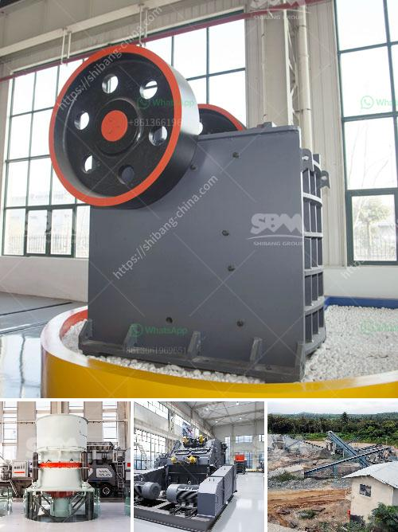

<h3>mtm trapezium mill</h3>
The MTM trapezium mill is a popular grinding mill widely used in many industries such as metalworking, construction, chemical, mining, and other related industries. It is designed to grind all kinds of non-flammable and non-explosive materials with hardness less than 9.3 and humidity less than 6 percent.

One of the key features of the MTM trapezium mill is its high efficiency. It utilizes the unique trapezoidal face design, which provides an increased grinding surface area. This results in higher grinding efficiency and improved productivity. Additionally, the mill has a high-speed rotating bevel gear that allows for smoother operation and ensures low noise levels.

Another advantage of the MTM trapezium mill is its adjustable fineness. The mill is equipped with a high-density impeller that can produce super fine powder, making it suitable for various applications. The fineness of the grinding product can be adjusted by changing the speed of the classifier blower, allowing users to achieve the desired particle size easily.

Furthermore, the MTM trapezium mill features a compact structure, making it easy to install and maintain. The mill has a small footprint, which is ideal for limited spaces. Its modular design also allows for easy transportation and relocation. Additionally, the mill is equipped with an automatic lubrication system that reduces maintenance time and ensures smooth operation.

Durability is another noteworthy aspect of the MTM trapezium mill. It is built with high-quality materials, ensuring long-lasting performance. The wear-resistant parts are made of durable alloy steel, which can withstand the grinding of various materials and provide a longer service life. This reduces the frequency of spare part replacements, contributing to cost savings for users.

The MTM trapezium mill also prioritizes safety and environmental protection. It is equipped with a high-pressure spring system that effectively prevents the materials from entering the grinding chamber until they are sufficiently crushed, minimizing the risk of accidents. Moreover, the mill incorporates a dust removal system that effectively collects and filters the dust generated during the grinding process, reducing air pollution.

In conclusion, the MTM trapezium mill is a reliable and efficient grinding mill that offers numerous benefits to its users. Its high efficiency, adjustable fineness, compact structure, durability, and safety features make it a preferred choice in a variety of industries. Whether it is used for metalworking, construction, chemical, or mining applications, the MTM trapezium mill is a versatile and valuable asset.
<h3>Contact us</h3><ul><li><strong>Whatsapp:&nbsp;<a href="https://wa.me/8613661969651">+8613661969651</a></strong></li><li><a href="https://swt.shibang-china.com/?git&amp;zhl&amp;mtm trapezium mill"><strong>Online Service(chat now)</strong></a></li></ul><h3>Related</h3><ul><li><a href='pulverizer limestone crusher manufacturer in india.md'>pulverizer limestone crusher manufacturer in india</a></li><li><a href='pfw series impact crusher.md'>pfw series impact crusher</a></li><li><a href='sand wash plant hire perth.md'>sand wash plant hire perth</a></li><li><a href='calcium carbonate production line in germany.md'>calcium carbonate production line in germany</a></li><li><a href='price of gypsum plant.md'>price of gypsum plant</a></li></ul>