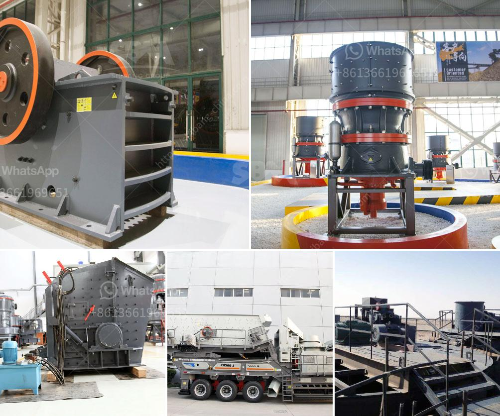

<h3>mtw 175 tanzania mill output in 325 mesh</h3>
The grinding mill industry plays a crucial role in the development of various industries. It is a useful tool that is used to grind various materials into different particle sizes. One such grinding mill is the MTW 175 Tanzania Mill, which is specifically designed to produce a high-quality output in 325 mesh.

The MTW 175 Tanzania Mill is manufactured by the renowned company, Shibang Machinery. It is a large-scale grinding mill that is designed with advanced technology and is highly efficient in its operation. The mill is suitable for grinding a wide range of materials, including limestone, calcite, dolomite, barite, talc, calcium carbonate, gypsum, bentonite, etc.

One of the notable features of the MTW 175 Tanzania Mill is its capability to produce output in 325 mesh. The term 'mesh' refers to the number of openings per linear inch in a screen through which particles of different sizes can pass. In this case, the mill is specially designed to produce a high-quality output with a particle size of 325 mesh.

The output produced by the MTW 175 Tanzania Mill in 325 mesh has several advantages. Firstly, it is ideal for applications that require fine grinding, such as the production of ultra-fine powders or the manufacturing of products with specific particle size requirements. The 325 mesh output ensures that the material is finely ground, resulting in a smooth and uniform texture.

Secondly, the 325 mesh output is suitable for industries that require a high level of precision, such as the pharmaceutical, chemical, or cosmetic industries. In these industries, the particle size of the material used in the production process can have a significant impact on the quality and effectiveness of the final product. The finely ground output in 325 mesh ensures that the material is of the desired size, leading to consistent and superior results.

Lastly, the MTW 175 Tanzania Mill's ability to produce output in 325 mesh makes it suitable for various industries in Tanzania. The country has a growing economy and a diverse range of industries, including mining, construction, agriculture, and manufacturing. The mill's capability to produce finely ground output in 325 mesh caters to the specific needs of these industries, allowing for efficient and quality production processes.

In conclusion, the MTW 175 Tanzania Mill is an exceptional grinding mill that delivers high-quality output in 325 mesh. Its advanced technology and efficient operation make it a reliable tool for industries that require fine grinding and precise particle size control. With its versatile applications and suitability for various industries in Tanzania, the mill proves to be a valuable asset in the country's development.
<h3>Contact us</h3><ul><li><strong>Whatsapp:&nbsp;<a href="https://wa.me/8613661969651">+8613661969651</a></strong></li><li><a href="https://swt.shibang-china.com/?git&amp;zhl&amp;mtw 175 tanzania mill output in 325 mesh"><strong>Online Service(chat now)</strong></a></li></ul><h3>Related</h3><ul><li><a href='used brick making machine for sale.md'>used brick making machine for sale</a></li><li><a href='coal screening machine for sale south africa.md'>coal screening machine for sale south africa</a></li><li><a href='quarry crusher equipment china.md'>quarry crusher equipment china</a></li><li><a href='hammer mill peru.md'>hammer mill peru</a></li><li><a href='crushers for rent in oman.md'>crushers for rent in oman</a></li></ul>