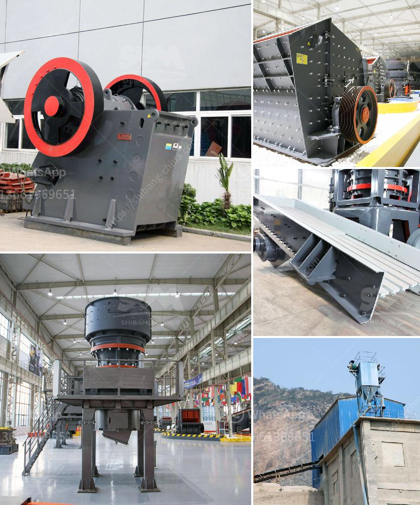

<h3>netherlands impact crushers</h3>
The Netherlands is renowned for its advanced engineering and innovative approaches in the field of construction. One such breakthrough in construction technology is the development and utilization of impact crushers. These machines, designed to crush and reduce the size of large rocks and stones, have revolutionized the construction industry in the Netherlands and beyond.

Impact crushers are known for their ability to create aggregates with excellent particle shape and size distribution, which is crucial for the production of high-quality concrete and asphalt. This has made them an essential tool in the construction of roads, bridges, and buildings. The Netherlands, with its extensive network of well-maintained infrastructure, has benefited significantly from these crushers.

Apart from their efficiency in reducing the size of aggregates, impact crushers also contribute to environmental sustainability. They are designed to minimize the emission of dust and noise, making them ideal for urban construction projects. Additionally, the use of impact crushers reduces the need for virgin aggregate extraction, conserving natural resources and minimizing the environmental impact caused by such activities.

The Netherlands, being a country prone to flooding, has also utilized impact crushers in the development of hydraulic engineering projects. These machines can break down and compact concrete debris from demolished structures, allowing the material to be recycled and used in the construction of flood defenses and water management systems. In this way, impact crushers play a critical role in ensuring the safety and resilience of the country's infrastructure.

The success of impact crushers in the Netherlands can be attributed to the country's commitment to innovation and sustainability. Dutch companies, in collaboration with research institutions, have continually worked towards improving the performance and efficiency of these machines. This has led to the development of advanced impact crushers that can handle larger quantities of material and operate at higher speeds, further enhancing their productivity and cost-effectiveness.

In conclusion, impact crushers have made a significant impact on the construction industry in the Netherlands, revolutionizing the way aggregates are produced and utilized. With their ability to create high-quality materials, minimize environmental impact, and contribute to innovative construction techniques, these machines have become an indispensable tool in the Dutch construction sector. As the country continues to invest in research and development, the future of impact crushers looks promising, paving the way for further advancements in the field of construction and infrastructure development.
<h3>Contact us</h3><ul><li><strong>Whatsapp:&nbsp;<a href="https://wa.me/8613661969651">+8613661969651</a></strong></li><li><a href="https://swt.shibang-china.com/?git&amp;zhl&amp;netherlands impact crushers"><strong>Online Service(chat now)</strong></a></li></ul><h3>Related</h3><ul><li><a href='limestone processing plant price.md'>limestone processing plant price</a></li><li><a href='grinding mill for limestone italy in bergamo.md'>grinding mill for limestone italy in bergamo</a></li><li><a href='costs of conveyor belts.md'>costs of conveyor belts</a></li><li><a href='detail project report on quartz powder plant.md'>detail project report on quartz powder plant</a></li><li><a href='floatation washing machine for silica sand.md'>floatation washing machine for silica sand</a></li></ul>