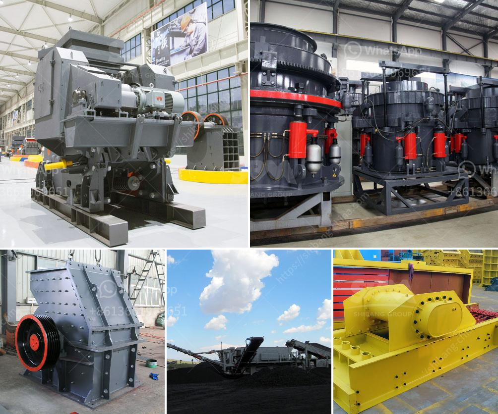

<h3>new crushing machine in south africa</h3>
In recent years, with the rapid development of infrastructure construction in South Africa, the demand for raw materials such as aggregate and sand has been increasing rapidly. Crushing and screening equipment plays a vital role in the construction industry because it provides the necessary aggregates that are used to build roads, bridges, and buildings.

As the primary crushing equipment, the new mobile jaw crusher machine has greatly expanded the concept of coarse crushing areas. Its purpose of design is to stand in the position of customers, to eliminate the obstacles that the crushing site and environment bring to the customers' crushing operations. It provides customers with efficient and low-cost project operation hardware facilities. This new mobile crusher brings increased convenience to the crushing industry in South Africa.

South Africa is experiencing economic growth, leading to a rapid expansion of infrastructure projects that require aggregate materials. The stone crusher equipment plays an important role in the stone crushing industry in South Africa. With the rapid development of mining infrastructure, some broken machinery in the mining industry is broken market opportunities for new stone crusher equipment.

South Africa's crushing and screening industries are developing in the direction of green, energy-saving and intelligentization, which requires crushing and screening equipment to achieve environmental protection, energy saving, high efficiency, and intelligence.

South Africa's mining industry is rich in mineral resources, and the demand for the crushing equipment in the market is highly anticipated. The crushing equipment manufactured by SBM has been exported to more than 130 countries. Our products have been widely used in stone crushing, mineral processing, and construction waste recycling technology. The mobile crushing equipment has been welcomed in countries such as Russia, Kazakhstan, Uzbekistan, Pakistan, India, Indonesia, and South Africa.

The new crushing machine in South Africa is specially designed for granite. It is equipped with a hopper, vibrating feeder, PE jaw crusher, cone crusher, vibrating screen and belt conveyors. Before the granite crushing plant is shipped to the client, the engineers will carry out the inspection and load test, ensuring that the equipment stable and reliable operation.

In conclusion, granite has widely applications in South Africa, such as the construction industry, highway and railway construction, reservoir and other fields. The crushing equipment has been successfully applied to the granite stone processing, which not only brings high efficiency and energy saving, but also brings high-quality finished stones for customers. The mobile crushing machine is favored by customers due to its environmental protection, energy saving, low operation cost, and high efficiency. With the increasing exploitation of mineral resources, the market demand for mining machinery and equipment for crushing materials will continue to grow, providing more opportunities for crushing machines in South Africa.
<h3>Contact us</h3><ul><li><strong>Whatsapp:&nbsp;<a href="https://wa.me/8613661969651">+8613661969651</a></strong></li><li><a href="https://swt.shibang-china.com/?git&amp;zhl&amp;new crushing machine in south africa"><strong>Online Service(chat now)</strong></a></li></ul><h3>Related</h3><ul><li><a href='alluvial gold washing plants in south africa.md'>alluvial gold washing plants in south africa</a></li><li><a href='crushing service with peru jaw crusher.md'>crushing service with peru jaw crusher</a></li><li><a href='msme ball mill project report.md'>msme ball mill project report</a></li><li><a href='aggregate machine in south africa.md'>aggregate machine in south africa</a></li><li><a href='mobile quarry crushing plant price in jamaica.md'>mobile quarry crushing plant price in jamaica</a></li></ul>