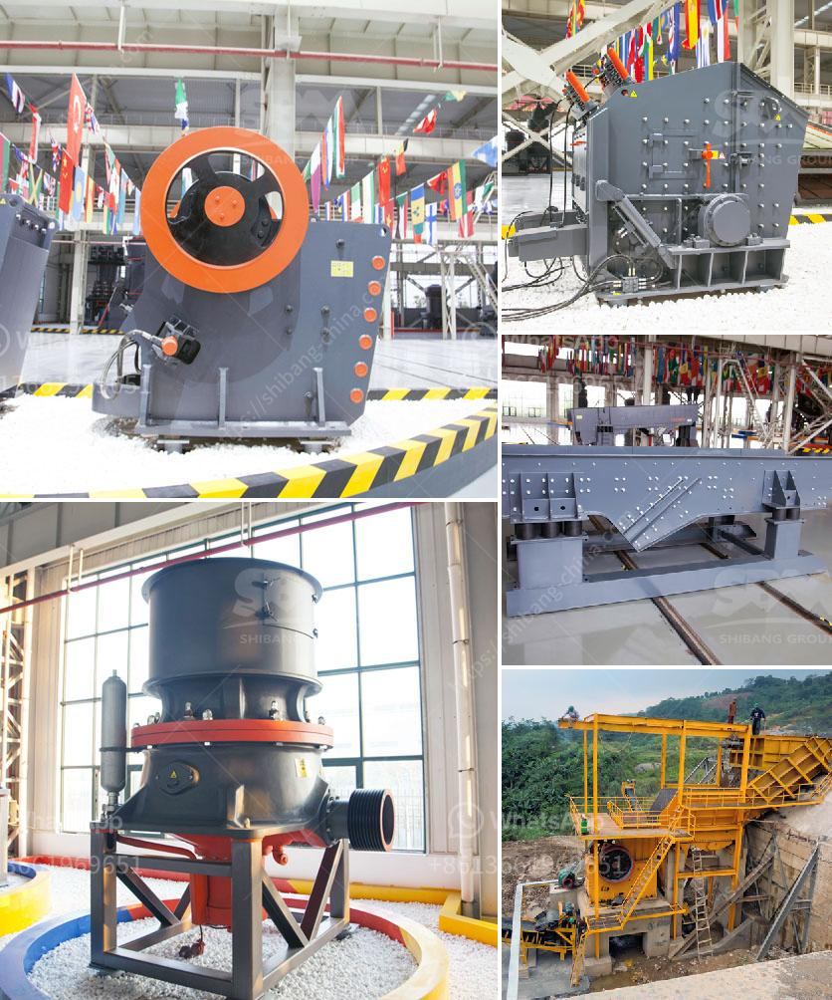

<h3>nigeira mobile crushing plant</h3>
The mobile crushing plant is a powerful production line that plays a significant role in a wide range of industries. This innovative facility allows the extraction and crushing of various types of raw materials, such as rocks, gypsum, sandstones, construction waste, coal, concrete, and similar materials. This mobile plant can crush any material, right at the construction site, reducing the cost of transportation and providing an efficient solution to curbing pollution.

In Nigeria, the mobile crushing plant is commonly used in the mining industry for the crushing and screening of various stones and minerals. With this solution, it is possible to produce a wide range of crushed products that are suitable for commercial applications such as road base, concrete aggregates, and asphalt.

One of the key advantages of the mobile crushing plant in Nigeria is its compact size. With the ability to be transported easily, it can be set up in any location and quickly moved from one site to another. This mobility feature allows mining companies to reach remote areas without the need for extensive infrastructure development, significantly reducing costs and time.

Furthermore, this type of crushing plant offers high efficiency and productivity. The crushers in the plant are designed to be durable and robust, ensuring a constant and reliable operation. Additionally, the plant is equipped with advanced technology, including intelligent control systems and energy-saving components that optimize the production process.

The mobile crushing plant in Nigeria also addresses the issue of waste disposal in the mining industry. This innovative solution eliminates the need for truck transportation, thereby reducing carbon emissions and other forms of pollution. By crushing materials directly at the mining site, waste can be transformed into valuable products, helping mining companies make more sustainable and environmentally friendly choices.

In conclusion, the introduction of mobile crushing plants in Nigeria has revolutionized the mining industry. These plants offer numerous advantages, such as cost savings, increased productivity, and reduced environmental impact. As the demand for raw materials continues to grow, the mobile crushing plant will play a crucial role in meeting the needs of the Nigerian mining industry while contributing to sustainable development.
<h3>Contact us</h3><ul><li><strong>Whatsapp:&nbsp;<a href="https://wa.me/8613661969651">+8613661969651</a></strong></li><li><a href="https://swt.shibang-china.com/?git&amp;zhl&amp;nigeira mobile crushing plant"><strong>Online Service(chat now)</strong></a></li></ul><h3>Related</h3><ul><li><a href='ball mill inside.md'>ball mill inside</a></li><li><a href='pulverizer crusher manufacturers ppt.md'>pulverizer crusher manufacturers ppt</a></li><li><a href='crusher new used for sale in uae.md'>crusher new used for sale in uae</a></li><li><a href='quarry crusher equipment china.md'>quarry crusher equipment china</a></li><li><a href='cement clinker processing machine.md'>cement clinker processing machine</a></li></ul>