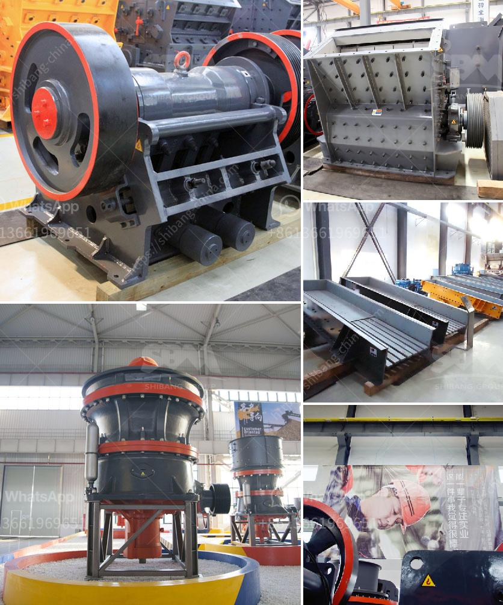

<h3>nigeria crusher plant 200 tph</h3>
In today's construction industry, the demand for crushed stones and other materials for various infrastructure projects is constantly increasing. The need for efficient and reliable crushing equipment is also intensifying, especially in countries like Nigeria, where the demand for construction materials is thriving. One of the essential tools in any crushing operation is a crusher plant, specifically designed to break large rocks and stones into smaller pieces. One such crusher plant gaining popularity in Nigeria is the 200 TPH model, which is widely utilized in building highways, railways, and other construction projects.

Crushing plants make use of a large range of equipment, such as a pre-screener, loading conveyor, intake hopper, magnetic separator, crushing unit, jaw crushers, cone crushers, etc. These are ideal for crushing various rocks, stones, ores, and minerals, making them a vital part of a crushing circuit. The 200 TPH crusher plant is equipped with a vibrating grizzly feeder and jaw crusher. A sturdy and reliable structure ensures high efficiency and extends the service life of the equipment. The plant also incorporates an accurately adjustable output setting, which facilitates the production of crushed materials with a consistent size.

Crusher plants play a crucial role in producing high-quality aggregate materials necessary for construction projects, such as roads, railway ballasts, and concrete. Therefore, it is essential to select the right type of crusher plant to ensure the required production capacity and particle size range. The 200 TPH crusher plant in Nigeria is equipped with advanced technology and features a simple structure, making it flexible and easy to operate, maintain, and repair.

In Nigeria's booming construction industry, the importance of crusher plants cannot be overemphasized. With the increasing demand for crushed stones and other construction materials, a 200 TPH crusher plant provides the foundation for swift execution and efficient transportation of these materials to various construction sites. By investing in a reliable and productive crusher plant, construction companies in Nigeria can enhance their efficiency, reduce costs, and meet the demands of their clients effectively.
<h3>Contact us</h3><ul><li><strong>Whatsapp:&nbsp;<a href="https://wa.me/8613661969651">+8613661969651</a></strong></li><li><a href="https://swt.shibang-china.com/?git&amp;zhl&amp;nigeria crusher plant 200 tph"><strong>Online Service(chat now)</strong></a></li></ul><h3>Related</h3><ul><li><a href='philippines crushing machine manufacturer in pakistan.md'>philippines crushing machine manufacturer in pakistan</a></li><li><a href='sell jaw crusher for turkey.md'>sell jaw crusher for turkey</a></li><li><a href='gold plant for sale philippines.md'>gold plant for sale philippines</a></li><li><a href='wet ball milling.md'>wet ball milling</a></li><li><a href='mining of granite companies.md'>mining of granite companies</a></li></ul>