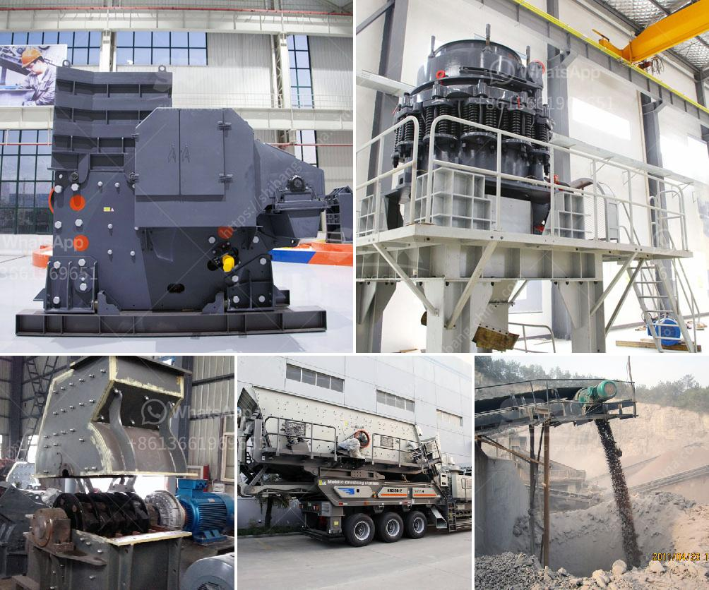

<h3>nigeria crusher price</h3>
Nigeria, as a developing nation, has experienced rapid industrialization and an increased demand for construction materials. Crushers play a crucial role in providing essential aggregates used in road construction, building foundations, and other infrastructure projects. However, understanding the pricing factors of crushers is vital for individuals and businesses looking to make informed decisions in Nigeria's booming construction industry.

The demand for crushers in Nigeria is on the rise due to the country's rapid urbanization and infrastructure development projects. With a growing population and increasing urbanization rate, the need for housing and transportation systems has led to a surge in the demand for construction materials, including aggregates. This demand has created a competitive market, with various local and international manufacturers offering a wide range of crushers to meet customer requirements.

Crusher prices in Nigeria depend on several factors, including the brand, type, capacity, and quality of the equipment. Different crushers cater to specific crushing needs, such as jaw crushers for primary crushing or cone crushers for secondary and tertiary crushing. These variations in specifications directly influence the pricing of crushers, with high-quality and specialized crushers typically commanding higher prices.

The production and import costs directly impact the overall pricing of crushers in Nigeria. International manufacturers often face additional expenses such as shipping, tariffs, and infrastructure costs when importing crushers into the country. On the other hand, locally manufactured crushers may have lower costs due to reduced transportation and import expenses. However, the quality and reliability of locally manufactured crushers should be thoroughly assessed before making a purchase.

Currency fluctuations can significantly influence the pricing of crushers in Nigeria. Nigeria's currency, the Naira, is subject to fluctuations against major world currencies, such as the US dollar and the Euro. Importing crushers may become more expensive during periods of Naira depreciation, as manufacturers need to adjust their prices to offset the increased costs. It is essential for buyers to monitor exchange rates and consider the impact on crusher prices when planning a purchase.

The after-sales support offered by manufacturers and suppliers is an essential factor to consider when analyzing crusher prices. Adequate technical support, spare parts availability, and a comprehensive warranty can enhance the long-term value and functionality of the equipment. Such support may justify a higher initial investment in a crusher, as it ensures reliable operation, reduces downtime, and minimizes maintenance costs in the long run.

Understanding Nigeria's crusher price dynamics involves considering various factors, including market demand, competition, quality, manufacturing costs, exchange rates, and after-sales support. As the construction industry continues to expand, the demand for crushers will soar, prompting manufacturers to offer a variety of options to meet customer requirements. Evaluating all these factors enables buyers to make informed decisions while considering the long-term durability, reliability, and functionality of the crusher they intend to purchase in Nigeria's construction and infrastructure development sector.
<h3>Contact us</h3><ul><li><strong>Whatsapp:&nbsp;<a href="https://wa.me/8613661969651">+8613661969651</a></strong></li><li><a href="https://swt.shibang-china.com/?git&amp;zhl&amp;nigeria crusher price"><strong>Online Service(chat now)</strong></a></li></ul><h3>Related</h3><ul><li><a href='laboratory jaw crusher.md'>laboratory jaw crusher</a></li><li><a href='production of cement mill in africa.md'>production of cement mill in africa</a></li><li><a href='crushing service with peru jaw crusher.md'>crushing service with peru jaw crusher</a></li><li><a href='mobile crushing and screening to hire south africa.md'>mobile crushing and screening to hire south africa</a></li><li><a href='clay grinding machine.md'>clay grinding machine</a></li></ul>