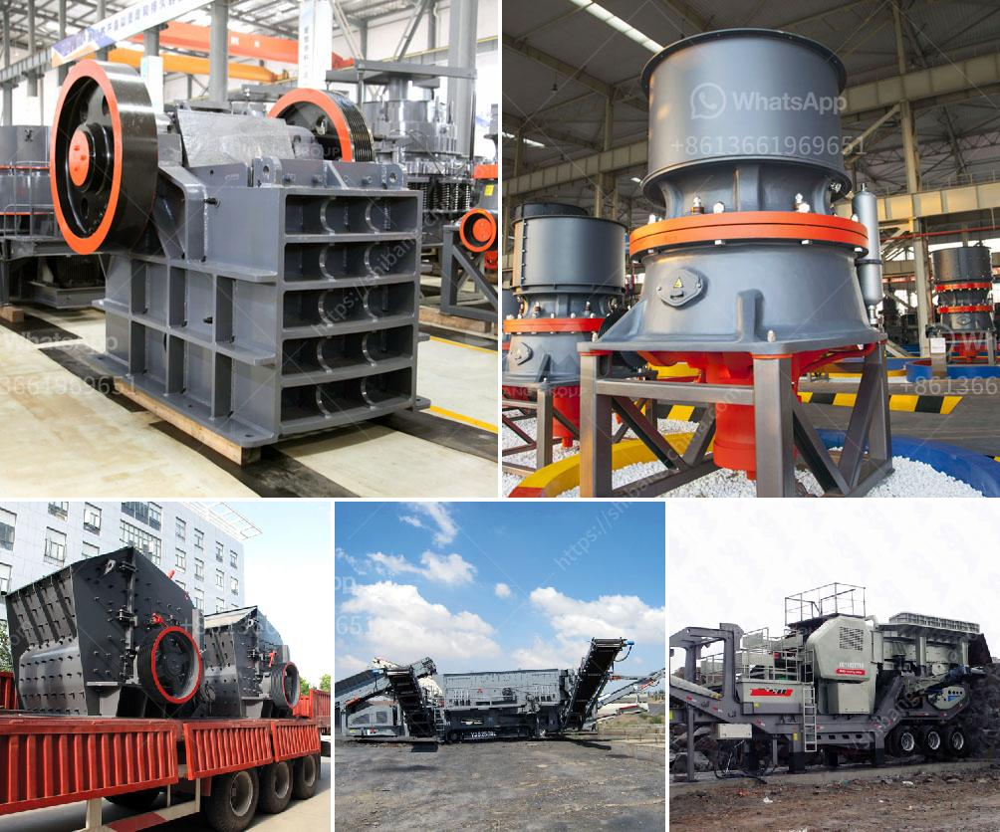

<h3>onsite construction debris recycling machines</h3>
In today's era, where sustainability and environmental protection have become paramount, it is essential to find innovative ways to manage waste generated from construction sites. Construction debris, often consisting of concrete, wood, metal, and other materials, can have a significant impact on the environment if not handled properly. However, the implementation of onsite construction debris recycling machines has emerged as a sustainable solution to address this issue efficiently.

Onsite construction debris recycling machines are advanced equipment that can transform waste materials into reusable resources, reducing the amount of waste sent to landfills. With the capability to process various construction materials, these machines have the potential to revolutionize waste management in the construction industry.

One of the key advantages of onsite construction debris recycling machines is their ability to significantly reduce transportation requirements. Traditionally, construction waste would be loaded onto trucks and transported to recycling facilities or landfills. This process not only consumes valuable time and energy but also adds to pollution levels due to vehicle emissions. By having recycling machines onsite, the need for transportation is minimized, resulting in reduced emissions and fuel consumption.

Moreover, these machines have the capacity to break down different construction materials, such as concrete, bricks, and asphalt, into smaller pieces, making them ready for reuse in new construction projects. This recycling process not only saves valuable resources but also reduces the demand for new materials, ultimately diminishing the environmental impact associated with extraction and production.

In addition to the environmental benefits, onsite construction debris recycling machines also offer economic advantages. By recycling materials onsite, construction companies can reduce waste disposal costs. Traditional waste management methods involve fees for landfill usage, transportation costs, and the procurement of new materials. Recycling machines eliminate or minimize these expenses, resulting in significant cost savings for construction companies.

Furthermore, the use of onsite construction debris recycling machines can positively impact a company's reputation as a sustainable and environmentally conscious organization. In today's market, where consumers and clients increasingly value and prioritize sustainability, having the ability to recycle construction waste onsite can differentiate a company from its competitors. It showcases a commitment to reducing environmental impact and promotes a positive image for the brand.

To optimize the benefits of onsite construction debris recycling machines, proper training and maintenance are essential. Construction site workers should be educated on the use and maintenance of these machines to ensure their smooth operation. Regular maintenance checks and necessary repairs should also be carried out to keep the equipment in optimal condition, extending its lifespan and maximizing its efficiency.

In conclusion, onsite construction debris recycling machines have emerged as a sustainable and efficient solution for waste management in the construction industry. By recycling materials onsite, these machines reduce transportation requirements, save costs, conserve resources, and promote sustainability. Their integration into construction sites not only benefits the environment but also enhances the reputation and competitiveness of construction companies. Embracing these innovative recycling machines is a step towards a greener and more sustainable future for the construction industry.
<h3>Contact us</h3><ul><li><strong>Whatsapp:&nbsp;<a href="https://wa.me/8613661969651">+8613661969651</a></strong></li><li><a href="https://swt.shibang-china.com/?git&amp;zhl&amp;onsite construction debris recycling machines"><strong>Online Service(chat now)</strong></a></li></ul><h3>Related</h3><ul><li><a href='pebble crushing machine.md'>pebble crushing machine</a></li><li><a href='japan used rolling mill.md'>japan used rolling mill</a></li><li><a href='200 tph mobile crusher prices used.md'>200 tph mobile crusher prices used</a></li><li><a href='calcium carbonate production line in germany.md'>calcium carbonate production line in germany</a></li><li><a href='mini mill 12x20 jaw crusher.md'>mini mill 12x20 jaw crusher</a></li></ul>