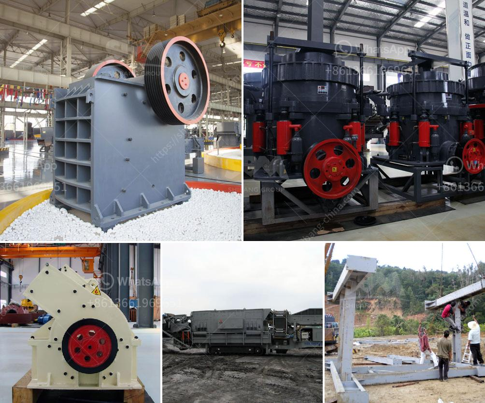

<h3>operation of stone crusher and screening</h3>
The stone crusher and screening operation is a fundamental machine in mining and quarrying. It is an essential machine in construction industry as well. The machine ensures that materials are crushed and screened to obtain the desired aggregate size for various construction purposes.

The operation of the stone crusher and screening is essential in mining and quarrying. Crushing operation breaks raw material into smaller pieces and reduces the size of these pieces to achieve desired aggregate size. Screening operation screens the crushed materials to ensure that they meet the desired aggregate size.

The stone crusher operation is simple and straightforward. Once the stones are loaded into the hopper, they are fed into a jaw crusher evenly and continuously by vibrating feeder. The large stones are initially crushed by jaw crusher, and then broken into smaller particles by cone crusher and impact crusher.

During the screening operation, the crushed materials are separated into different sizes. This is typically done by a vibrating screen, which consists of a screen deck that vibrates vertically. The vibrating action separates the different sizes of stones, allowing only the desired aggregate size to pass through the screen and be collected.

The stone crusher and screening operation has evolved over time for efficient and effective use in construction projects. Initially, the machine was manually operated and controlled by a person. However, with advancements in technology, automation systems have been developed to streamline the operation and increase productivity.

Modern stone crusher and screening machines are automated and operated by a computer. The computer analyzes the input from various sensors and adjusts the settings of the machine accordingly to achieve optimal performance. This ensures that the machine operates at its maximum capacity while minimizing downtime.

The stone crusher and screening operation is crucial in construction projects as it provides the necessary aggregates for various applications. These aggregates are used in the construction of roads, highways, bridges, buildings, and other infrastructure projects. Without the stone crusher and screening operation, construction would be significantly hindered.

In conclusion, the operation of the stone crusher and screening machine is a crucial step in the mining and quarrying process. It ensures that the stones are crushed to the desired size and screened to separate the different sizes of aggregates. This operation is fundamental in providing the necessary materials for construction projects. With advancements in automation technology, the operation has become more efficient and productive, further enhancing the construction industry.
<h3>Contact us</h3><ul><li><strong>Whatsapp:&nbsp;<a href="https://wa.me/8613661969651">+8613661969651</a></strong></li><li><a href="https://swt.shibang-china.com/?git&amp;zhl&amp;operation of stone crusher and screening"><strong>Online Service(chat now)</strong></a></li></ul><h3>Related</h3><ul><li><a href='mining procedure in zambia.md'>mining procedure in zambia</a></li><li><a href='german crusher plants.md'>german crusher plants</a></li><li><a href='equipment to start up a quarry crusher.md'>equipment to start up a quarry crusher</a></li><li><a href='small grinding machine for limestone.md'>small grinding machine for limestone</a></li><li><a href='mobile crushers for hire in philippines.md'>mobile crushers for hire in philippines</a></li></ul>