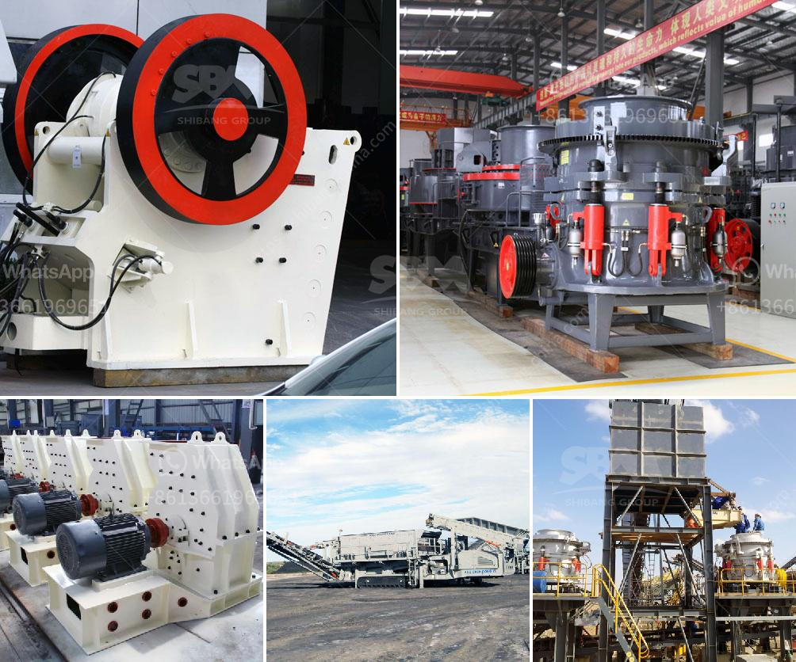

<h3>orifice of coal mill machine</h3>
The orifice of a coal mill machine is a circular opening located at the top of the grinding chamber. It serves as a passage to guide the coal particles into the grinding section of the mill. This intricate mechanism is crucial for continuous coal pulverization within the coal-fired power plant.

The primary function of the orifice is to regulate the coal flow into the mill and prevent it from being overloaded. When the coal is fed into the machine, it needs to be ground into smaller particles, which can then be burnt efficiently to generate heat. By adjusting the orifice's size, the flow rate of coal can be controlled, ensuring optimal grinding conditions.

A well-designed orifice plays a critical role in maintaining the mill's stability and efficiency. If the orifice is too small, it can lead to a reduced coal flow rate, causing insufficient pulverization. As a result, the coal particles may not be finely ground, decreasing the overall combustion efficiency. On the other hand, if the orifice is too large, it may allow an excessive amount of coal to enter the mill, overwhelming the grinding system and potentially causing equipment damages.

To ensure the orifice's effectiveness, it must be properly maintained and regularly inspected. Over time, coal dust can accumulate around the orifice, affecting its efficiency. The orifice should be cleaned periodically to remove any blockages or buildup, allowing for smooth coal flow. Furthermore, wear and tear can also occur over extended usage. Hence, it is essential to monitor the orifice's condition and replace it if any signs of degradation are detected.

In addition to the orifice's size, its shape and geometry also impact the coal grinding process. Different manufacturers might use various orifice designs to optimize the milling operation. For instance, some orifices may have a conical shape, while others could be cylindrical. The choice of design depends on several factors, such as the coal's characteristics, desired fineness, and mill design. Each shape influences the flow patterns of the coal particles, affecting their residence time and grinding efficiency within the mill.

Moreover, advancements in technology have led to the development of automated orifice control systems. These systems utilize sensors to monitor the coal flow rate in real-time and adjust the orifice accordingly. By continuously optimizing the orifice's size, these systems can enhance the mill's performance, reduce energy consumption, and extend the equipment's lifespan.

In conclusion, the orifice of a coal mill machine is a crucial component that regulates the coal flow and controls the grinding process. Its proper design, maintenance, and monitoring are essential for achieving efficient and reliable coal pulverization. With further advancements in the field, we can expect more sophisticated orifice control systems that enhance the overall efficiency and sustainability of coal-fired power plants.
<h3>Contact us</h3><ul><li><strong>Whatsapp:&nbsp;<a href="https://wa.me/8613661969651">+8613661969651</a></strong></li><li><a href="https://swt.shibang-china.com/?git&amp;zhl&amp;orifice of coal mill machine"><strong>Online Service(chat now)</strong></a></li></ul><h3>Related</h3><ul><li><a href='mobile gold hammer crusher for sale philippines.md'>mobile gold hammer crusher for sale philippines</a></li><li><a href='rock crusher for sale in botswana.md'>rock crusher for sale in botswana</a></li><li><a href='small scale stone crusher machine in kenya.md'>small scale stone crusher machine in kenya</a></li><li><a href='precio trituradora de tierras en pakistan.md'>precio trituradora de tierras en pakistan</a></li><li><a href='recycling of construction materials.md'>recycling of construction materials</a></li></ul>