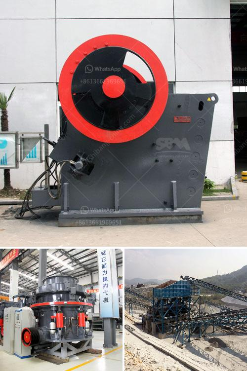

<h3>output of crushing plant</h3>
The output of a crushing plant is based upon a predetermined range of specifications. Contingent upon the type of raw material, availability of plant resources, and the capacity of a crusher unit, each crushing plant is designed for a specific output production. Domestic locales with smaller populations or higher costs usually prefer a smaller-sized plant. On the other hand, industrial areas with larger populations or economies of scale seek crushing plants with higher output capacities. In this article, we will discuss the factors influencing the output of a crushing plant and the benefits of having a plant with a higher production capacity.

Several factors affect the output of a crushing plant. Firstly, the raw material composition plays a crucial role. Materials with higher hardness require more powerful crushers, which subsequently increase the energy consumption. Moreover, the granularity of the raw material also impacts the crushing process. Finer raw materials may require additional equipment, such as fine crushers or a more advanced crushing circuit, to ensure the desired output. As a result, the scalability of the crushing plant becomes an essential consideration during the design phase.

Another crucial factor is the availability of resources within the plant. Adequate power supply, sufficient water, and a constant supply of raw materials are necessary to maintain uninterrupted production. Insufficient resources can lead to downtime, causing a significant decrease in output. Therefore, the availability and reliability of these resources are vital.

The capacity of the main crusher unit also affects the output. If the unit is limited in its capacity and can only handle a certain amount of material during each crushing cycle, then the output of the entire plant is directly affected. Larger and more powerful crushers are usually employed for high-output quarries, such as those producing aggregate for road construction or asphalt plants.

The benefits of having a crushing plant with higher output capacity are numerous. Firstly, it allows for increased efficiency in the production process. With larger capacity crushers, more material can be processed at once, reducing the need for downtime and accelerating the overall production rate. This, in turn, leads to higher profits and better returns on investment for the plant owner.

Moreover, a higher output capacity can also serve as a competitive advantage in the market. In industries such as construction or aggregate production, where demand fluctuates, having a crushing plant that can handle larger volumes allows the producer to fulfill orders more promptly. This can result in improved customer satisfaction and increased market share.

Additionally, a crushing plant with higher output capacity provides better flexibility. It can handle a wide range of raw materials without requiring frequent modifications or adaptations. This enables the plant to adjust to market demands and eliminates the need for investing in multiple crushers or production lines.

In conclusion, the output of a crushing plant is influenced by factors such as raw material composition, resource availability, and the capacity of the main crusher unit. Having a plant with a higher output capacity offers several benefits, including increased efficiency, competitive advantage, and flexibility. Ultimately, investing in a crushing plant with a higher production capacity can lead to improved profitability and business success.
<h3>Contact us</h3><ul><li><strong>Whatsapp:&nbsp;<a href="https://wa.me/8613661969651">+8613661969651</a></strong></li><li><a href="https://swt.shibang-china.com/?git&amp;zhl&amp;output of crushing plant"><strong>Online Service(chat now)</strong></a></li></ul><h3>Related</h3><ul><li><a href='jaw crusher price in nigeria.md'>jaw crusher price in nigeria</a></li><li><a href='precio trituradora de tierras en pakistan.md'>precio trituradora de tierras en pakistan</a></li><li><a href='fluorite ore processing equipment manufacturer.md'>fluorite ore processing equipment manufacturer</a></li><li><a href='dry wash prospecting unit for sale western philippines.md'>dry wash prospecting unit for sale western philippines</a></li><li><a href='grinding media charge calculation in cement ball mills.md'>grinding media charge calculation in cement ball mills</a></li></ul>