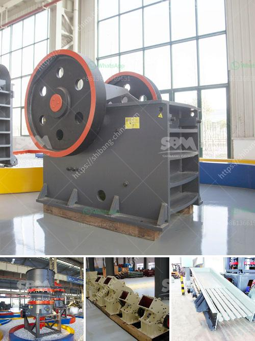

<h3>pebble crushing line</h3>
In the realm of aggregate and construction material production, pebble crushing represents a crucial step in ensuring optimal efficiency and productivity. A pebble crushing line is a production line composed of various crushing equipment used to crush pebbles or river stones into construction sand and gravel. The finished products can be widely used in industries such as construction, railways, water conservancy, and highways. This article aims to explore the importance of pebble crushing lines and shed light on their significant benefits.

One of the key advantages of a pebble crushing line is its ability to optimize resource utilization. With the increasing demand for construction materials, it is crucial to extract and utilize resources efficiently. Pebble crushing lines can help achieve this goal by utilizing nearby river stones or pebbles. As these materials are readily available, the transportation cost and environmental impact associated with resource procurement are significantly reduced. Furthermore, using local resources enhances the sustainability of the project, as it reduces dependency on imported materials.

Another distinct advantage of a pebble crushing line is its ability to produce high-quality construction sand and gravel. The equipment used in these lines, such as jaw crushers, cone crushers, and impact crushers, are specially designed for crushing hard and abrasive materials. This ensures that the produced aggregates have excellent shape, low flakiness, and high compressive strength, making them suitable for various construction applications. High-quality aggregates not only contribute to the durability and stability of structures but also minimize maintenance and repair costs in the long run.

Moreover, pebble crushing lines offer increased productivity and efficiency in the production process. The automation and intelligent control systems incorporated in these lines help streamline operations, reduce human error, and enhance overall productivity. With the advancement of technology, modern crushing equipment can adjust the crushing parameters in real-time to optimize the production process according to specific needs. These automated systems, combined with the high crushing efficiency of the equipment and the continuous operation of the production line, ensure a steady supply of aggregates, thereby avoiding delays and interruptions in construction projects.

Additionally, it is worth mentioning the environmental benefits associated with pebble crushing lines. The construction industry is responsible for a significant proportion of global carbon emissions. By using a pebble crushing line, construction companies can reduce their carbon footprint by avoiding the need to transport aggregates over long distances. Moreover, the equipment used in these lines is designed to minimize dust and noise pollution, creating a cleaner and more sustainable working environment. By adhering to stricter environmental regulations, companies can improve their reputation and contribute to a greener planet.

In conclusion, pebble crushing lines present numerous advantages in terms of resource utilization, aggregate quality, productivity, and environmental sustainability. They offer an efficient and cost-effective solution for producing high-quality construction materials. As the demand for aggregates continues to rise, investing in a pebble crushing line becomes an increasingly viable option for construction companies. By optimizing resource utilization and improving production processes, these lines contribute to the growth and development of the construction industry while minimizing environmental impact.
<h3>Contact us</h3><ul><li><strong>Whatsapp:&nbsp;<a href="https://wa.me/8613661969651">+8613661969651</a></strong></li><li><a href="https://swt.shibang-china.com/?git&amp;zhl&amp;pebble crushing line"><strong>Online Service(chat now)</strong></a></li></ul><h3>Related</h3><ul><li><a href='buy mobile crusher in usa.md'>buy mobile crusher in usa</a></li><li><a href='gold plant for sale philippines.md'>gold plant for sale philippines</a></li><li><a href='3 meters conveyor belts.md'>3 meters conveyor belts</a></li><li><a href='stone crusher for gold mining indonesia.md'>stone crusher for gold mining indonesia</a></li><li><a href='stone crushing machine for sale in uganda.md'>stone crushing machine for sale in uganda</a></li></ul>