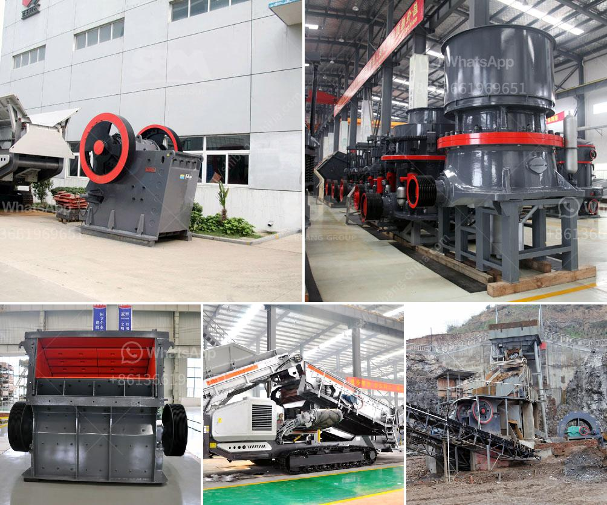

<h3>pebble crushing machine</h3>
Pebbles are small, round stones that are commonly found near bodies of water, such as rivers and beaches. These natural stones have various applications, including decorative landscaping, construction, and even in the manufacturing of ceramics and glass. However, before these pebbles can be used in different industries, they need to be crushed into smaller sizes.

This is where a pebble crushing machine comes into play. A pebble crushing machine is a reliable and efficient tool used to grind or crush pebbles into smaller sizes, making them easier to be used in various applications. The machine uses a combination of crushing techniques to reduce the size of pebbles, resulting in a more manageable and valuable end product.

One of the primary reasons why pebble crushing machines are in high demand is due to their effectiveness in processing pebbles. These machines are specifically designed to handle the hardness and abrasiveness of pebbles, ensuring that they can be crushed into the desired size without causing excessive wear or damage to the machine itself. Furthermore, the crushing process is carefully controlled, ensuring that the final product is of consistent quality.

In terms of design, pebble crushing machines are typically equipped with a sturdy steel frame, a powerful motor, and a crushing chamber. The crushing chamber contains a series of hammers or bars that impact the pebbles, breaking them into smaller pieces. Some machines may also include a screen or mesh to separate the crushed pebbles into different sizes.

The benefits of using a pebble crushing machine are plenty. Firstly, it allows for efficient processing of pebbles, minimizing the time and effort required to crush large quantities of stones. This is especially beneficial for large-scale operations where a significant amount of pebbles need to be processed on a daily basis.

Secondly, the crushed pebbles produced by these machines are more uniform in size, making them suitable for a wide range of applications. For example, crushed pebbles can be used as construction materials in concrete production, as a decorative element in landscaping, or even as a raw material in manufacturing processes.

Additionally, pebble crushing machines are designed to be durable and long-lasting, capable of withstanding the harsh conditions typically associated with the crushing process. This means that operators can rely on these machines to deliver consistent performance and produce high-quality crushed pebbles for an extended period.

In conclusion, a pebble crushing machine is an essential tool for the efficient processing of pebbles in various industries. Its ability to crush pebbles into smaller, more manageable sizes provides numerous benefits, including increased efficiency, versatility, and consistent quality. Whether used in construction, manufacturing, or landscaping, pebble crushing machines play a crucial role in maximizing the value and usability of this natural resource.
<h3>Contact us</h3><ul><li><strong>Whatsapp:&nbsp;<a href="https://wa.me/8613661969651">+8613661969651</a></strong></li><li><a href="https://swt.shibang-china.com/?git&amp;zhl&amp;pebble crushing machine"><strong>Online Service(chat now)</strong></a></li></ul><h3>Related</h3><ul><li><a href='crushing plant process flow.md'>crushing plant process flow</a></li><li><a href='detail project report on quartz powder plant.md'>detail project report on quartz powder plant</a></li><li><a href='ball mill operation cost.md'>ball mill operation cost</a></li><li><a href='ultrafine mill crusher price in india.md'>ultrafine mill crusher price in india</a></li><li><a href='calculation of a cost of a crusher.md'>calculation of a cost of a crusher</a></li></ul>