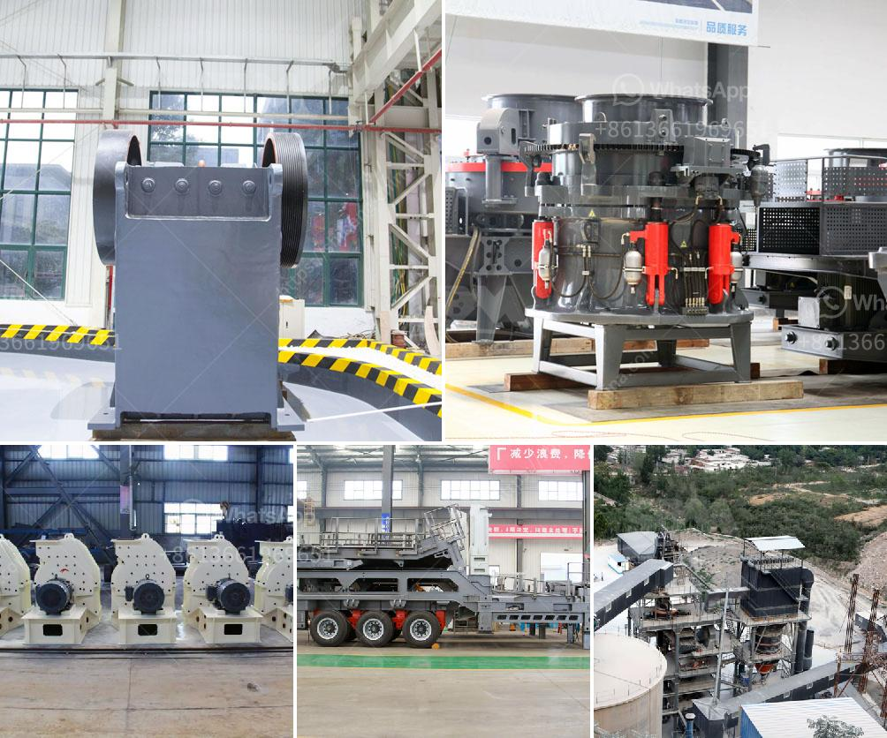

<h3>pf impact crusher for stone breaking machine for sale</h3>
PF impact crusher, the advantages and disadvantages of commonly used stone breaking machines compared with the two, the advantages of PF impact crusher are outstanding. It has the advantages of large crushing ratio, uniform particle size, low energy consumption, convenient maintenance and so on. The finished product is a cube and has no tension or cracks.

The impact crusher mainly uses the high-speed rotation of the rotor to carry out a high-speed impact crushing of the material. The impact crusher has a high crushing ratio of 40, thus simplifying the crushing process from the three periods crushing to two or one-period crushing, which saves the equipment fee of the dressing plant.

PF series impact crusher can process all kinds of coarse, medium and fine materials (granite, limestone, concrete, etc.) with side length not exceeding 500mm and compressive strength not exceeding 350MPa. The impact crusher is widely used in various ore crushing, railway, highway, energy, cement, chemical, construction and other industries. The size of the discharge material can be adjusted according to different production needs.

Compared with other types of crushing equipment, the PF impact crusher machine has a greater reduction ratio and can better use the high-speed impact energy of the whole rotor. However, as a result, the impact crusher has a higher crushing ratio, especially for medium and fine materials, which can reach 20:1. Therefore, for a medium-sized crushing equipment, the PF impact crusher can not only meet the production capacity requirements of 300 tons per hour, but also can reduce the production cost for its low energy consumption of about 0.6 kWh per ton of finished materials.

Several features of PF impact crusher made it ideal choice for its widely applications. The discharging granularity can be adjusted flexibly. The sieves are easy to be changed and replaced for PF series impact crusher. Thus, the entire set of equipment is of low unit consumption. As a result, it is affordable for many customers for its being cheap and practical. The structure is simple and the operating cost is low. The crushing chamber is deep and has no dead zone, which improves the feeding capacity and output. With large crushing ratio, the final product of PF impact crusher is cubic, and the discharge grain size is adjustable, which can simplify the crushing process and meet the different needs of customers.

In summary, PF impact crusher has a large crushing ratio, high crushing efficiency and convenient maintenance. It is widely used in the sand making industry and stone crushing industry. In addition, it is also suitable for construction waste disposal, which can effectively solve the problems of dust pollution in construction waste disposal and improve the application of construction waste in recycled aggregates. With its unique advantages and excellent performance, PF impact crusher is for sale and has been exported to over 90 countries around the world. We ensure that customers can be guaranteed with both the quality of equipment and the low price of equipment. As a leading manufacturer of mining machinery, we have a variety of crushing equipment for sale, such as jaw crusher, impact crusher, cone crusher and mobile crusher. These equipment have been exported to many countries and regions around the world, and can be customized according to customer requirements.
<h3>Contact us</h3><ul><li><strong>Whatsapp:&nbsp;<a href="https://wa.me/8613661969651">+8613661969651</a></strong></li><li><a href="https://swt.shibang-china.com/?git&amp;zhl&amp;pf impact crusher for stone breaking machine for sale"><strong>Online Service(chat now)</strong></a></li></ul><h3>Related</h3><ul><li><a href='mobile quarry crushing plant price in jamaica.md'>mobile quarry crushing plant price in jamaica</a></li><li><a href='jaw crusher agen surabaya.md'>jaw crusher agen surabaya</a></li><li><a href='grinding plant material gold.md'>grinding plant material gold</a></li><li><a href='sayaji impact crusher.md'>sayaji impact crusher</a></li><li><a href='limestone processing plant supplier.md'>limestone processing plant supplier</a></li></ul>