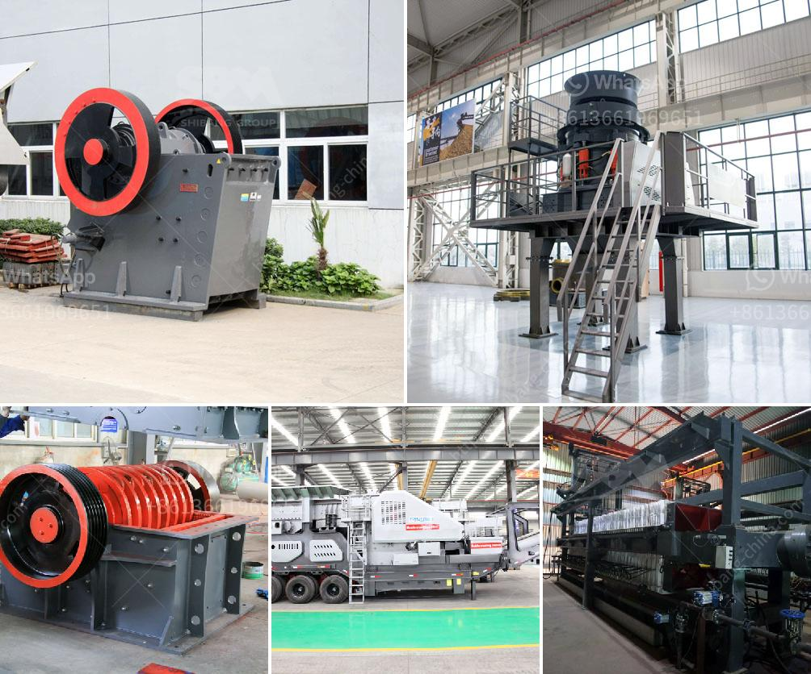

<h3>pfw series impact crusher</h3>
The PFW series impact crusher is a versatile and efficient machine that is designed to be used in various industries and applications. Its robust construction and high-quality materials ensure its durability and reliability, making it an excellent choice for crushing materials.

One of the key features of the PFW series impact crusher is its unique design. It has a heavy-duty rotor and a strong impact plate that are made of high wear-resistant materials. This allows the crusher to effectively crush and shape the materials, producing high-quality end products.

The PFW series impact crusher also has an adjustable discharge gap, so you can control the size of the final product. This makes it ideal for producing a wide range of materials, from fine to coarse. Additionally, the crusher’s hydraulic system ensures a smooth and stable operation, further enhancing its efficiency.

Another advantage of the PFW series impact crusher is its versatility. It can be used to crush a variety of materials, including limestone, concrete, asphalt, and ore. This makes it suitable for use in construction, mining, and recycling industries. Whether you need to process aggregates for road construction or crush ore for mineral extraction, the PFW series impact crusher is up to the task.

Furthermore, the PFW series impact crusher is easy to maintain. It is designed with accessibility in mind, with the maintenance points positioned at convenient locations. This helps reduce downtime and ensures that the crusher can be quickly and efficiently serviced.

In conclusion, the PFW series impact crusher is a reliable and efficient machine that offers high performance and versatility. Whether you need to crush concrete, limestone, or ore, this crusher can handle the job. Its robust construction, unique design, and easy maintenance make it a valuable asset in various industries.
<h3>Contact us</h3><ul><li><strong>Whatsapp:&nbsp;<a href="https://wa.me/8613661969651">+8613661969651</a></strong></li><li><a href="https://swt.shibang-china.com/?git&amp;zhl&amp;pfw series impact crusher"><strong>Online Service(chat now)</strong></a></li></ul><h3>Related</h3><ul><li><a href='philippines crushing machine manufacturer in pakistan.md'>philippines crushing machine manufacturer in pakistan</a></li><li><a href='hammer crusher mill.md'>hammer crusher mill</a></li><li><a href='rental of crusher in malaysia.md'>rental of crusher in malaysia</a></li><li><a href='3 roller pulvarising mill manufacturer.md'>3 roller pulvarising mill manufacturer</a></li><li><a href='concrete stones crushing business plan.md'>concrete stones crushing business plan</a></li></ul>