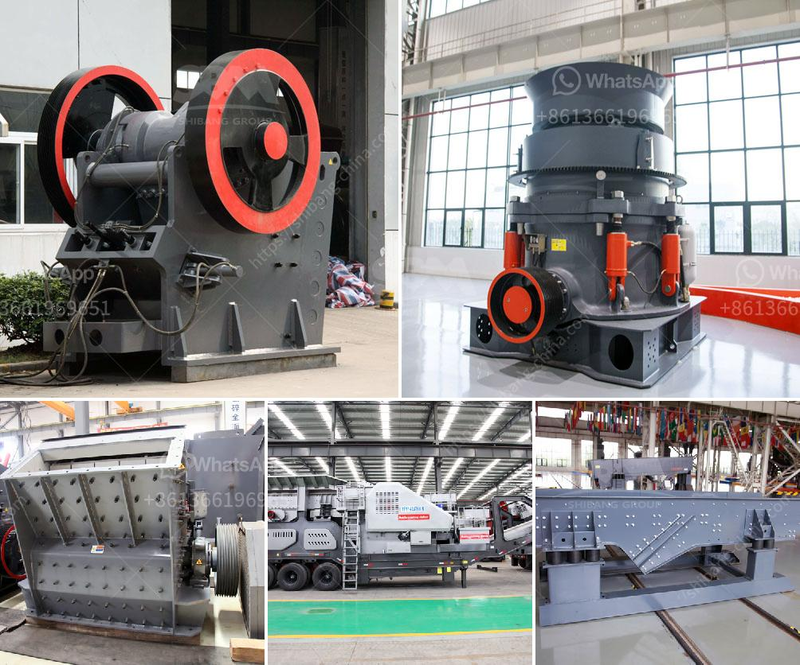

<h3>philippines crushing machine manufacturer in pakistan</h3>
Title: Philippines Crushing Machine Manufacturers in Pakistan: Delivering Quality Machinery to Boost Industrial Growth

The Philippines has shown remarkable growth in several industries, including construction, mining, and agriculture. A key factor behind this development is the presence of cutting-edge machinery manufactured by leading companies. One such industry, which has played a pivotal role in empowering the nation's industrial growth, is the crushing machine manufacturing sector. In recent years, Pakistani industries have witnessed an upswing in the demand for crushing machines, and Filipino manufacturers have risen to the occasion by offering top-of-the-line equipment.

Philippines crushing machine manufacturers are renowned for their expertise in designing and producing high-quality machinery that caters to the unique needs of various industries. The range of machines available includes jaw crushers, cone crushers, impact crushers, and vibrating screens, among others. Designed to withstand harsh conditions and heavy workloads, these machines ensure maximum productivity and efficiency, enabling businesses to achieve their operational goals effectively.

The availability of quality crushing machines from the Philippines is a boon for Pakistani industries that heavily rely on such equipment. Industries like construction, mining, and agriculture require efficient crushing machines to process raw materials, extract minerals, and produce high-quality aggregates. The collaboration between Filipino manufacturers and Pakistani industrialists has fostered technological advancements and enabled the local industries to enhance their productivity and competitiveness on a global scale.

The partnership between Filipino crushing machine manufacturers and Pakistani industries goes beyond just selling machinery. It allows for knowledge sharing, technology exchange, and continuous improvement. Such collaborations have encouraged Philippine manufacturers to understand the specific requirements of Pakistani industries and provide customized solutions. The willingness of both parties to promote mutual growth ensures a win-win situation that fosters long-term business relationships.

The presence of Philippines crushing machine manufacturers in Pakistan has brought about a revolution in the local industrial landscape. Access to high-quality machinery has significantly contributed to increased efficiency, improved productivity, and enhanced output for numerous industries. As the demand for crushing machines continues to rise, Filipino manufacturers remain committed to delivering cutting-edge equipment and forging stronger partnerships with Pakistani industries. Ultimately, this collaboration will support economic growth and pave the way for a prosperous future for both nations.
<h3>Contact us</h3><ul><li><strong>Whatsapp:&nbsp;<a href="https://wa.me/8613661969651">+8613661969651</a></strong></li><li><a href="https://swt.shibang-china.com/?git&amp;zhl&amp;philippines crushing machine manufacturer in pakistan"><strong>Online Service(chat now)</strong></a></li></ul><h3>Related</h3><ul><li><a href='used stone crushers in south africa in zambia.md'>used stone crushers in south africa in zambia</a></li><li><a href='stone crusher machine south africa.md'>stone crusher machine south africa</a></li><li><a href='impact crushing machine manufacturer.md'>impact crushing machine manufacturer</a></li><li><a href='grinding lm vertical mill.md'>grinding lm vertical mill</a></li><li><a href='business plan for sand making machine.md'>business plan for sand making machine</a></li></ul>