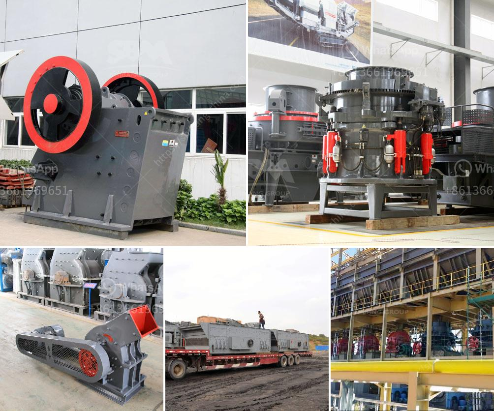

<h3>philippines rock and granite quarries</h3>
The Philippines is rich in natural resources, including rock and granite quarries. This abundance has led to the establishment of numerous quarries throughout the country, particularly in the mountainous regions. Rock and granite, being durable and versatile materials, have long been used in construction, making these quarries a crucial part of the local industry.

One prominent area in the Philippines known for its rock and granite quarries is Benguet. Located in the Cordillera Administrative Region, Benguet encompasses the major city of Baguio and is also known for its breathtaking mountainous landscapes. These mountains are home to various types of rocks and minerals, creating a rich geological environment for quarrying activities.

Rock quarries in Benguet extract a wide range of materials, including limestone, shale, sandstone, and volcanic materials. These materials are then processed and used for construction projects, such as roads, buildings, and infrastructure. Granite quarries, on the other hand, focus specifically on extracting granite, a popular rock known for its durability and aesthetic appeal. Granite is widely used for countertops, flooring, and cladding in both residential and commercial projects.

The extraction process in these quarries typically involves drilling, blasting, and crushing the rock. Explosives are used to break down the rock into smaller pieces, which are then transported to processing facilities. Heavy machinery, such as bulldozers, loaders, and crushers, is employed to handle the large volumes of rock efficiently.

Aside from Benguet, other regions in the Philippines also have rock and granite quarries. Some notable areas include Rizal and Batangas, which are both located near the capital region of Metro Manila. These quarries supply construction materials to meet the demands of the bustling metropolitan area.

Quarrying activities in the Philippines have faced challenges due to concerns about its environmental impact. The extraction process can lead to deforestation, soil erosion, and disturbance of natural habitats. However, efforts are being made to mitigate these issues. Quarry operators are required to secure permits and comply with strict regulations set by the government to ensure sustainable practices.

Moreover, the industry is also actively exploring ways to minimize its carbon footprint. Quarry operators are implementing initiatives such as reforestation programs and the use of eco-friendly equipment to reduce the environmental impact of their operations. These efforts aim to balance the economic benefits of quarrying with the need for environmental preservation.

Rock and granite quarries play a vital role in the Philippines' construction industry, providing essential materials for infrastructure development. While there are environmental concerns associated with quarrying activities, steps are being taken to ensure sustainable practices and minimize negative impacts. With proper regulation and responsible quarrying practices, the industry can continue to thrive and contribute to the country's development while safeguarding the environment.
<h3>Contact us</h3><ul><li><strong>Whatsapp:&nbsp;<a href="https://wa.me/8613661969651">+8613661969651</a></strong></li><li><a href="https://swt.shibang-china.com/?git&amp;zhl&amp;philippines rock and granite quarries"><strong>Online Service(chat now)</strong></a></li></ul><h3>Related</h3><ul><li><a href='gypsum powder manufacturing plant price.md'>gypsum powder manufacturing plant price</a></li><li><a href='calculations on the capacity of cone crusher.md'>calculations on the capacity of cone crusher</a></li><li><a href='crushing rock export manufacturers india.md'>crushing rock export manufacturers india</a></li><li><a href='dolomite lime manufacturers in ghana.md'>dolomite lime manufacturers in ghana</a></li><li><a href='iron crushing machine cost.md'>iron crushing machine cost</a></li></ul>