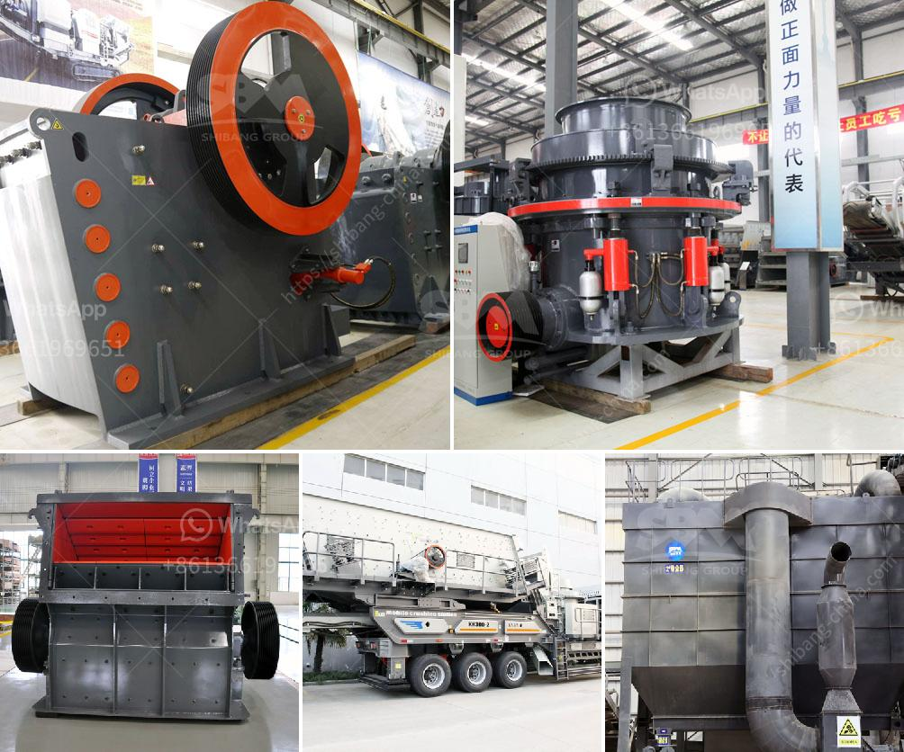

<h3>pin for an industrial hammer mill</h3>
Industrial hammer mills are robust machines that are capable of crushing and grinding large materials into fine particles. These mills are widely used in various industries, including mining, agriculture, and construction. One crucial component of an industrial hammer mill is the pin.

A pin is a cylindrical piece of metal that is inserted into the rotor of the hammer mill. It plays a vital role in the grinding process by delivering impact force to the materials being processed. The pins are strategically arranged on the rotor and rotate at high speeds, striking the material and reducing its size.

The design and quality of the pin are crucial for the efficient operation of the hammer mill. Pins are typically made of hardened steel or high carbon steel to withstand the intense impact and abrasion involved in the grinding process. The hardened steel pins ensure that they can withstand heavy usage without wearing out quickly, thus reducing maintenance needs and downtime.

The size and shape of the pin also contribute to the hammer mill's performance. The length and thickness of the pin determine the level of impact force and the resulting particle size reduction. Longer pins deliver more force and a greater grinding effect, while shorter pins are suitable for finer grinding applications.

Another important aspect of the pin design is its shape. The most common pin shape used in industrial hammer mills is a rectangular or square cross-section. This design provides a larger striking surface area, allowing for better crushing and grinding efficiency. More recently, some manufacturers have started using pins with a triangular or rounded cross-section, claiming improved performance and reduced energy consumption.

The installation and maintenance of the pin in an industrial hammer mill are essential to ensure its optimal performance. Proper alignment of the pins on the rotor and regular inspection for wear are essential for trouble-free operation. If a pin is damaged or worn out, it should be replaced immediately to prevent further damage to the rotor and the hammer mill itself.

In conclusion, the pin is a critical component of an industrial hammer mill that plays a vital role in the grinding process. Its design, material, size, and shape all contribute to the mill's efficiency and performance. Proper installation, alignment, and maintenance of the pin are crucial for prolonged and trouble-free operation. Manufacturers and operators must carefully consider pin design and quality to ensure optimal performance and maximize productivity in industrial hammer mills.
<h3>Contact us</h3><ul><li><strong>Whatsapp:&nbsp;<a href="https://wa.me/8613661969651">+8613661969651</a></strong></li><li><a href="https://swt.shibang-china.com/?git&amp;zhl&amp;pin for an industrial hammer mill"><strong>Online Service(chat now)</strong></a></li></ul><h3>Related</h3><ul><li><a href='grinding machine 2 micron for calcium carbonate.md'>grinding machine 2 micron for calcium carbonate</a></li><li><a href='toggle plate of jaw crusher.md'>toggle plate of jaw crusher</a></li><li><a href='crushing and screening plant supplier china.md'>crushing and screening plant supplier china</a></li><li><a href='vibration ranges for jaw crusher.md'>vibration ranges for jaw crusher</a></li><li><a href='limestone processing plant supplier.md'>limestone processing plant supplier</a></li></ul>