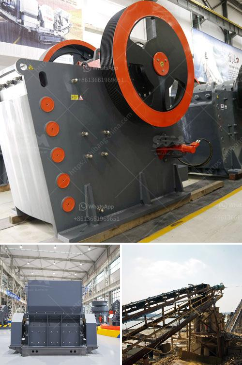

<h3>plant and machinery of quartz for sale in india</h3>
India is known for its rich reserves of minerals that are widely used in various industries. Quartz, a mineral consisting of silicon dioxide, is one such mineral that has gained immense popularity in recent times. With its unique properties and applications, the demand for quartz has witnessed a significant surge, leading to the need for well-equipped plant and machinery for its production. In India, there are several options available for the purchase of plant and machinery for quartz, catering to the needs of various industries.

Quartz, known for its high hardness and resistance to heat and chemical corrosion, has a wide range of industrial applications. It is extensively used in the production of glass, ceramics, and refractory materials, where its high silica content provides strength and durability. Additionally, quartz is also used in the production of semiconductors, electrical appliances, and even in the construction industry.

To cater to the growing demand for quartz, numerous manufacturers in India offer plant and machinery for its production. These equipments are designed to ensure efficient and cost-effective production of high-quality quartz materials. The available options include crushers, pulverizers, grinding mills, magnetic separators, and other specialized machinery required for the processing of quartz.

Crushers play a crucial role in the initial processing of quartz. They are used to break down large quartz rocks into smaller, more manageable sizes. Different types of crushers are available based on the specific requirements of the industry. Jaw crushers, cone crushers, and impact crushers are some common options for quartz crushing, each offering unique advantages in terms of size reduction and processing capabilities.

Once the quartz rocks are crushed, they go through a series of processes to further refine the material. Pulverizers, grinding mills, and ball mills are commonly used for this purpose. These machines grind the quartz into fine particles, ensuring that impurities are removed and the desired size and texture are attained. The choice of the machinery depends on factors like the required particle size, the volume of production, and the specific end-use of the quartz.

Magnetic separators are utilized in the final processing stage to remove any remaining impurities from the quartz material. These separators use magnets to attract and remove metallic or magnetic particles that could affect the quality of the final product. By effectively removing impurities, the magnetic separators contribute to the consistent quality and purity of the quartz.

In India, there are several manufacturers and suppliers of plant and machinery for quartz. Some well-known companies provide state-of-the-art technology and machinery to ensure efficient production processes. These manufacturers offer a comprehensive range of machines, customized to suit the specific needs of their clients. Additionally, they also provide installation, maintenance, and after-sales services, ensuring a hassle-free experience for the customers.

In conclusion, the demand for quartz in India has led to the availability of plant and machinery for its production. Crushers, pulverizers, grinding mills, magnetic separators, and other specialized machinery cater to the needs of various industries. These machines are designed to ensure efficient and cost-effective processing of quartz, resulting in high-quality materials. With the support of reliable manufacturers and suppliers, industries can obtain state-of-the-art equipment and capitalize on the immense potential of quartz in India.
<h3>Contact us</h3><ul><li><strong>Whatsapp:&nbsp;<a href="https://wa.me/8613661969651">+8613661969651</a></strong></li><li><a href="https://swt.shibang-china.com/?git&amp;zhl&amp;plant and machinery of quartz for sale in india"><strong>Online Service(chat now)</strong></a></li></ul><h3>Related</h3><ul><li><a href='gypsum grinding machine manufacturer in india.md'>gypsum grinding machine manufacturer in india</a></li><li><a href='slag grinding mill india.md'>slag grinding mill india</a></li><li><a href='berat mobile screen mobile crusher.md'>berat mobile screen mobile crusher</a></li><li><a href='stone crusher coalaries.md'>stone crusher coalaries</a></li><li><a href='stone crusher for excavator cost.md'>stone crusher for excavator cost</a></li></ul>