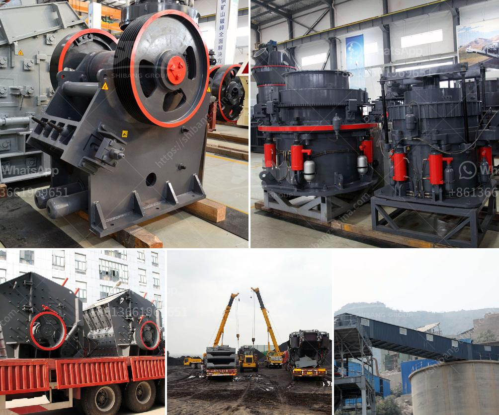

<h3>plant layout mini cement plant pdf</h3>
A plant layout plays a crucial role in the functioning and efficiency of a manufacturing unit. A well-designed plant layout not only helps in optimizing the available space but also ensures the smooth flow of materials and processes, resulting in enhanced productivity and cost savings. When it comes to the cement manufacturing industry, a plant layout for a mini cement plant is equally important for the successful operation.

A mini cement plant is typically smaller in size and capacity compared to a full-scale cement manufacturing facility. This makes the plant layout of utmost importance as it defines the organization of various processes and equipment present in the plant. An effective plant layout helps in achieving the desired production targets while minimizing the costs.

The first consideration in designing a plant layout for a mini cement plant is the location. The plant should be situated at a strategic location that is accessible to both raw material sources and market areas. This ensures a seamless supply chain and reduces transportation costs. Additionally, the location must comply with environmental regulations, such as being away from residential areas to minimize noise pollution.

The second aspect to consider is the flow of materials and processes within the plant. A well-designed flow allows for a logical and efficient sequence of activities. In the case of a mini cement plant, the raw materials, such as limestone, clay, and gypsum, are sourced from nearby quarries. These raw materials are then crushed, ground, and mixed in the right proportions to form the raw mix.

The raw mix is further processed in a rotary kiln, where it is heated at a high temperature to form clinker. The clinker is then cooled and ground into fine powder, which is the cement. The finished cement is stored in silos and packed in bags or transported in bulk for distribution. Each of these processes must be organized in a sequential manner, ensuring minimal downtime and efficient use of resources.

Another critical consideration in plant layout is the placement of equipment and machinery. The placement should allow for a smooth flow of materials between different machines and minimize the need for manual handling. Equipment like crushers, mills, and kilns should be located in close proximity to each other to minimize material transportation.

Furthermore, the layout should account for the safety of workers and efficient utilization of space. The plant should have designated areas for storage of raw materials, finished products, and waste. Adequate space should be allocated for maintenance workshops, administrative offices, and employee amenities.

In conclusion, a well-planned plant layout is of utmost importance for a mini cement plant as it determines the overall efficiency and productivity of the facility. The location, flow of materials, and placement of equipment are key factors to consider. Additionally, the layout should adhere to safety standards and optimize the utilization of space. With a well-designed plant layout, a mini cement plant can effectively meet production targets, minimize costs, and contribute to the overall growth of the cement industry.
<h3>Contact us</h3><ul><li><strong>Whatsapp:&nbsp;<a href="https://wa.me/8613661969651">+8613661969651</a></strong></li><li><a href="https://swt.shibang-china.com/?git&amp;zhl&amp;plant layout mini cement plant pdf"><strong>Online Service(chat now)</strong></a></li></ul><h3>Related</h3><ul><li><a href='gypsum processing plant in.md'>gypsum processing plant in</a></li><li><a href='dolomite processing plants from germany.md'>dolomite processing plants from germany</a></li><li><a href='distributor stone crusher surabaya.md'>distributor stone crusher surabaya</a></li><li><a href='hammer mill dimensions.md'>hammer mill dimensions</a></li><li><a href='granite processing machines china.md'>granite processing machines china</a></li></ul>