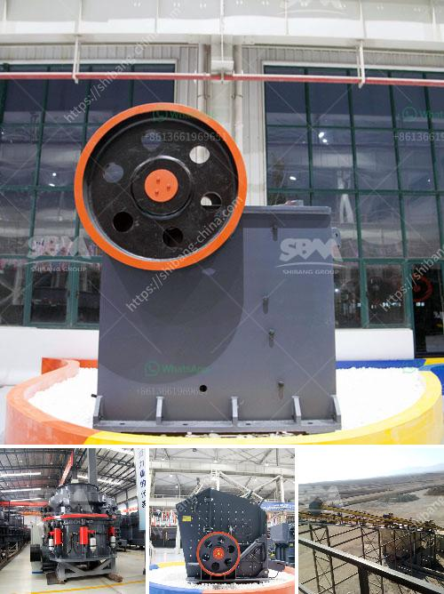

<h3>plant project report pdf stone crushing</h3>
In recent years, the construction industry has been flourishing due to the high demand for infrastructure projects. This has resulted in the need for more stone crushers to fulfill the requirement of raw materials for the construction industry. With a relatively low investment, the stone crushing plant project report is essential to determine the required set of machinery such as crushers, feeders, and screens.

The availability of these machines in the market is crucial and will depend on the geographical location of the plant. For instance, in areas where raw materials are readily available and the market is in proximity to the plant, the setup is relatively easy. On the other hand, plants located in remote areas might face challenges in terms of logistics and transportation.

The plant project report PDF stone crushing gives detailed information about the specific requirements for the setup of the plant and outlines the various factors that will contribute to the success of the project. It includes information about the market analysis, raw materials, machinery requirement, human resources, projected financials, and challenges.

1. Executive Summary: The executive summary provides a brief overview of the entire project. It highlights the key points and objectives of the project.

2. Introduction: This section provides an introduction to the stone crushing industry and the current market scenario.

3. Market Analysis: It includes a detailed analysis of the market, including the demand and supply of stones, competition, pricing, and growth potential.

4. Raw Materials: This section describes the sources of raw materials for the plant, their availability, and their procurement.

5. Machinery Requirement: It includes a detailed list of the machinery required for the stone crushing plant along with their specifications and estimated costs.

6. Human Resources: This section outlines the manpower required for the plant, including skilled and unskilled workers, supervisors, and engineers.

7. Financials: The financials section provides information about the estimated project cost, revenue projections, and profitability analysis.

8. Challenges: This section discusses the potential challenges and risks associated with the project and provides measures to mitigate them.

In conclusion, the stone crushing plant project report provides a comprehensive overview of the market and outlines the necessary steps to set up a stone crusher plant. It includes information about the machinery, raw materials, manpower, financials, and potential challenges. This report is essential for anyone planning to invest in the stone crushing industry.
<h3>Contact us</h3><ul><li><strong>Whatsapp:&nbsp;<a href="https://wa.me/8613661969651">+8613661969651</a></strong></li><li><a href="https://swt.shibang-china.com/?git&amp;zhl&amp;plant project report pdf stone crushing"><strong>Online Service(chat now)</strong></a></li></ul><h3>Related</h3><ul><li><a href='quartz stone heating machine for sale.md'>quartz stone heating machine for sale</a></li><li><a href='operation of stone crusher and screening.md'>operation of stone crusher and screening</a></li><li><a href='price on a mining ball mill 10 tons per hour.md'>price on a mining ball mill 10 tons per hour</a></li><li><a href='stone crusher rubber conveyor.md'>stone crusher rubber conveyor</a></li><li><a href='sandstone crusher.md'>sandstone crusher</a></li></ul>