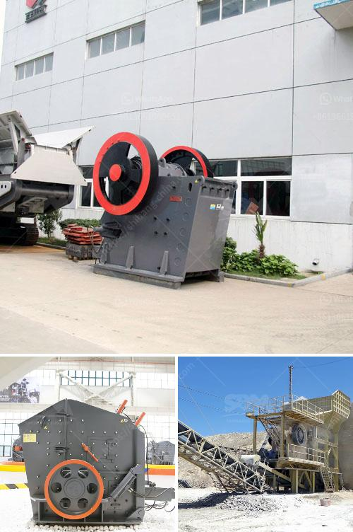

<h3>portable concrete crusher</h3>
Construction companies and contractors rely on concrete crushers to help them revolutionize their operations. As the demand for housing and infrastructure projects continues to rise, the need for versatile and efficient machinery is more critical than ever. A portable concrete crusher is an essential tool for many construction projects, especially those located in remote areas where access to larger equipment is limited.

Portable concrete crushers are a convenient way to recycle concrete and construction waste, making it accessible for demolition contractors, concrete recyclers, and others. These small, lightweight machines can move between job sites at a fast pace, taking on multiple tasks with ease. As a result, they provide significant cost savings and environmental benefits. Here are some advantages of using a portable concrete crusher:

1. Versatility: Portable concrete crushers can perform a wide range of tasks, including crushing concrete, recycling asphalt, and brick. Additionally, these machines can crush and process a variety of materials, including limestone, granite, and other types of stones. With the ability to recycle materials on-site, contractors and construction companies can save money on transportation and disposal fees.

2. Cost-effective: The use of portable concrete crushers greatly reduces the overall cost of demolition and construction projects. By recycling concrete onsite, contractors can avoid costly transportation and disposal fees associated with bringing concrete waste to landfills. Furthermore, recycled concrete can be used as a replacement for traditional aggregate, saving on material costs.

3. Efficiency: Portable concrete crushers allow contractors to quickly and efficiently complete projects. These machines can be transported to the job site and set up within minutes, reducing downtime and maximizing productivity. Additionally, the ability to crush materials directly on-site eliminates the need to transport materials back and forth, reducing fuel consumption and emissions.

4. Environmental benefits: Concrete waste accounts for a significant portion of construction and demolition debris. By recycling concrete on-site, contractors can reduce the need for quarrying of new materials, resulting in a reduced impact on the environment. Recycling concrete also helps conserve landfill space and reduces water and energy consumption associated with the production of traditional aggregate.

5. Accessibility: In remote areas where access to larger equipment is limited, portable concrete crushers provide a practical solution. These compact and lightweight machines can access narrow spaces and challenging terrains, enabling contractors to complete projects in areas where larger machinery cannot reach.

In conclusion, portable concrete crushers have become essential equipment for construction companies and contractors. The versatility, cost-effectiveness, and environmental benefits of using these machines make them a valuable asset on job sites. Whether it's crushing concrete, recycling asphalt, or processing various types of stones, a portable concrete crusher streamlines operations and helps maximize efficiency. As the construction industry continues to grow, investing in a portable concrete crusher is a proactive way to stay ahead of the curve and meet the demands of the market.
<h3>Contact us</h3><ul><li><strong>Whatsapp:&nbsp;<a href="https://wa.me/8613661969651">+8613661969651</a></strong></li><li><a href="https://swt.shibang-china.com/?git&amp;zhl&amp;portable concrete crusher"><strong>Online Service(chat now)</strong></a></li></ul><h3>Related</h3><ul><li><a href='gypsum powder production process in india pdf.md'>gypsum powder production process in india pdf</a></li><li><a href='mobile clusher for hire tanzania.md'>mobile clusher for hire tanzania</a></li><li><a href='ball milling in chemistry.md'>ball milling in chemistry</a></li><li><a href='rental of crusher in malaysia.md'>rental of crusher in malaysia</a></li><li><a href='conveyor belts contacts.md'>conveyor belts contacts</a></li></ul>