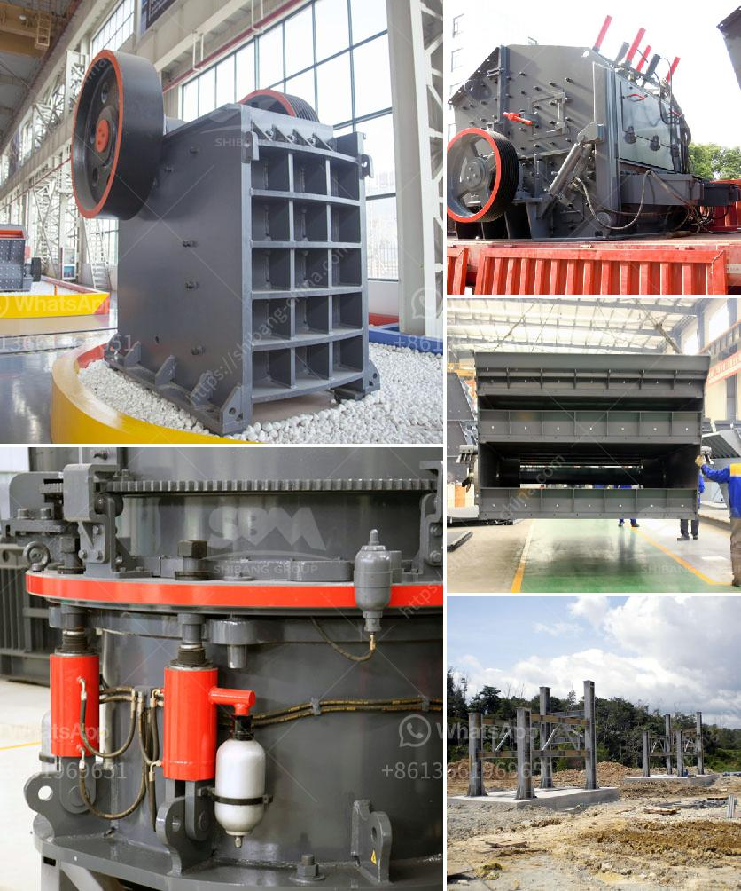

<h3>portable copper ore processing machines in usa</h3>
Copper ore is a valuable mineral resource that is widely mined and used across various industries for its high electrical conductivity and corrosion resistance. In the United States, copper deposits can be found in several states, including Arizona, Utah, New Mexico, Nevada, and Montana. To extract copper from these deposits, efficient and portable processing machines are necessary to enhance productivity and cost-effectiveness.

Portable copper ore processing machines have become popular for their mobility and flexibility in processing various copper ores. These machines can be easily transported to different mining sites, simplifying the logistics and reducing the need for infrastructure development. Additionally, portable machines can be set up and operational in a short period, minimizing downtime and maximizing production.

One of the main advantages of portable copper ore processing machines is their ability to process different types of copper ores. Copper ore can vary in composition and mineralogy, which can affect the extraction process and the quality of the final product. With portable machines, mining companies can easily adjust the processing parameters based on the specific ore characteristics, ensuring optimal copper recovery and minimizing waste.

Another significant advantage of portable copper ore processing machines is their low environmental impact. Traditional copper processing methods often require large-scale processing facilities, which can have adverse effects on the local environment. Portable machines, on the other hand, allow for smaller-scale operations, reducing the footprint and potential environmental disturbances.

Moreover, portable copper ore processing machines are equipped with advanced technologies that enhance efficiency and productivity. These machines are often automated, reducing the need for manual labor and associated costs. Advanced sorting and separation technologies help to increase the copper concentration in the final product, improving the overall economic value.

In addition to improving copper recovery, portable copper ore processing machines also contribute to sustainability and cost-effectiveness. By minimizing the transportation distance between the mining site and the processing plant, less fuel is consumed, reducing greenhouse gas emissions. Furthermore, portable machines can be easily repositioned, enabling mining companies to efficiently extract ores from different deposits without significant investment in new infrastructure.

The demand for portable copper ore processing machines is expected to grow in the United States as the mining industry continues to expand. With advancements in technology and an increasing focus on sustainability, these machines offer a practical solution for mining companies to extract copper efficiently and responsibly.

In conclusion, portable copper ore processing machines have become essential tools for mining operations in the United States. Their mobility, flexibility, and advanced technologies make them indispensable in extracting copper from various deposits efficiently. These machines not only enhance copper recovery and product quality but also contribute to sustainability and cost-effectiveness in the mining industry. As the demand for copper continues to rise, investing in portable processing machines is a logical choice for mining companies looking to optimize their operations.
<h3>Contact us</h3><ul><li><strong>Whatsapp:&nbsp;<a href="https://wa.me/8613661969651">+8613661969651</a></strong></li><li><a href="https://swt.shibang-china.com/?git&amp;zhl&amp;portable copper ore processing machines in usa"><strong>Online Service(chat now)</strong></a></li></ul><h3>Related</h3><ul><li><a href='crushing machine malaysia.md'>crushing machine malaysia</a></li><li><a href='dealer of steel balls for ball mill in manila.md'>dealer of steel balls for ball mill in manila</a></li><li><a href='ball milling in chemistry.md'>ball milling in chemistry</a></li><li><a href='25 tph vsi crushers.md'>25 tph vsi crushers</a></li><li><a href='used mobile crusher in uae.md'>used mobile crusher in uae</a></li></ul>