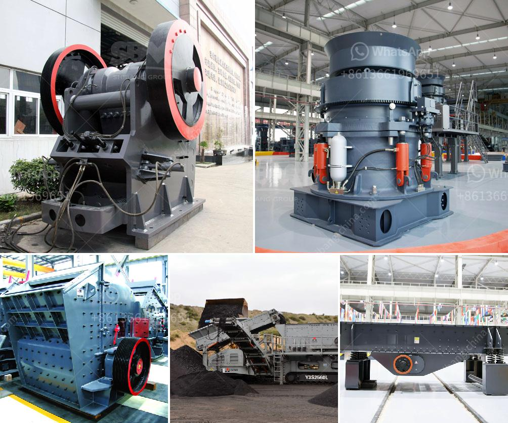

<h3>portable crusher plant</h3>
In the modern world, efficiency and convenience are key aspects in completing any task, whether it is work-related or personal. This is why the demand for portable crusher plants has increased significantly in recent years. A portable crusher plant is a versatile and powerful crushing device that is increasingly popular in mining, construction, and other industries where it provides convenient and efficient crushing solutions. 

One of the main advantages of a portable crusher plant is its mobility. These plants can be easily transported to different locations, allowing users to take advantage of their crushing capabilities wherever they are needed. This is particularly advantageous for construction sites, where materials need to be crushed on-site to save time and reduce transportation costs. Additionally, the mobility of these plants enables users to move them closer to the material source, further increasing efficiency and reducing processing time.

Another key feature of portable crusher plants is their ability to handle a wide range of materials. These plants can effectively crush various types of rocks, ores, and even concrete and asphalt. This versatility makes them suitable for different applications, whether it is mining, quarrying, or recycling. Furthermore, some plants come with different crusher types, such as jaw crushers, impact crushers, or cone crushers, allowing users to choose the most suitable option for their specific needs.

The efficiency of portable crusher plants is also worth mentioning. These plants are designed to maximize productivity and minimize downtime. They are equipped with powerful crushers and highly efficient screens that ensure the material is properly crushed and screened. Additionally, many plants are fitted with advanced control systems that enable operators to optimize the crushing process and adjust the settings to achieve the desired output.

Furthermore, portable crusher plants are designed with user-friendliness in mind. They come with features and technologies that make them easy to operate, maintain, and service. For instance, some plants have hydraulic lifting systems that facilitate quick and effortless setup. Others are equipped with automatic lubrication systems and remote control functions, which not only enhance safety but also simplify maintenance tasks. 

Lastly, portable crusher plants are an environmentally friendly alternative to traditional crushing methods. These plants are engineered to minimize dust and noise emissions, reducing their impact on the surrounding environment. Additionally, the ability to crush materials on-site eliminates the need to transport them to a central processing facility, thereby reducing carbon emissions associated with transportation.

In conclusion, portable crusher plants are a convenient and efficient crushing solution for various industries. Their mobility, versatility, and efficiency make them ideal for completing crushing tasks on-site, thereby saving time and reducing costs. Furthermore, their user-friendliness and environmental advantages make them a preferred choice for those seeking a sustainable crushing solution. As the demand for portable crusher plants continues to rise, it is expected that their features and technologies will further improve, offering even more convenience and efficiency to users.
<h3>Contact us</h3><ul><li><strong>Whatsapp:&nbsp;<a href="https://wa.me/8613661969651">+8613661969651</a></strong></li><li><a href="https://swt.shibang-china.com/?git&amp;zhl&amp;portable crusher plant"><strong>Online Service(chat now)</strong></a></li></ul><h3>Related</h3><ul><li><a href='feeding stone crushers.md'>feeding stone crushers</a></li><li><a href='basalt impact crusher price.md'>basalt impact crusher price</a></li><li><a href='types of crusher.md'>types of crusher</a></li><li><a href='granite processing machines china.md'>granite processing machines china</a></li><li><a href='mobile crusher for sale sri lanka stone crusher machine.md'>mobile crusher for sale sri lanka stone crusher machine</a></li></ul>