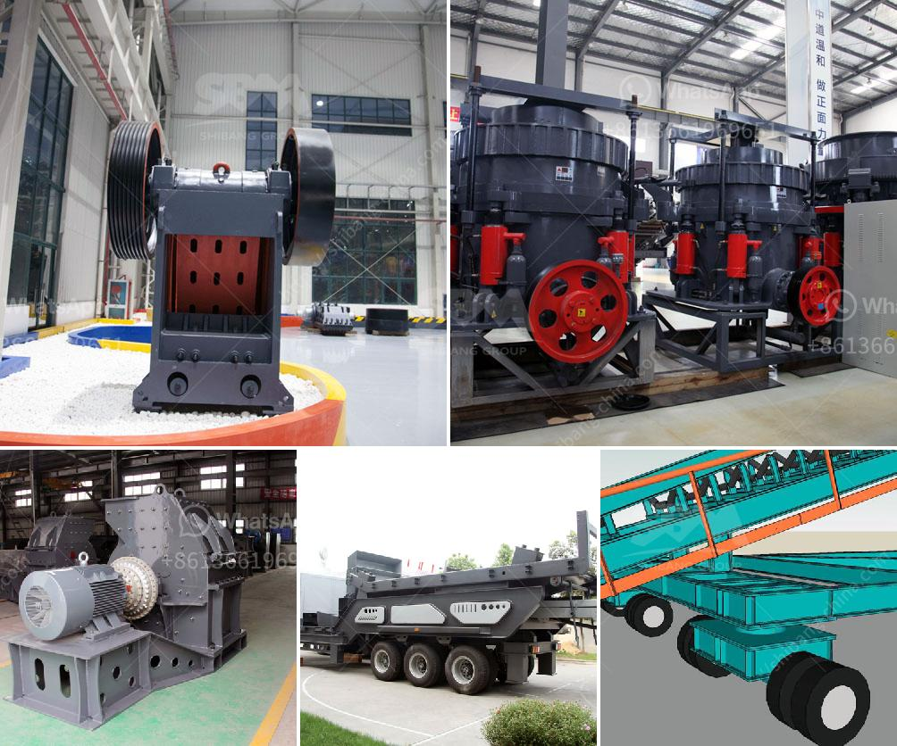

<h3>portable crushers sweden</h3>
Sweden is renowned for its innovative and efficient machinery, and the portable crusher industry is no exception. With a wide variety of portable crushers available, Swedish companies have a long-standing reputation for producing high-quality machines that are built to last.

Portable crushers are machines designed to reduce large rocks into smaller, more manageable sizes. They are commonly used in the construction, mining, and recycling industries, where crushing material on-site is essential for productivity and cost-efficiency.

Swedish portable crushers stand out due to their durability and versatility. These machines are often designed with the harsh Nordic climate in mind, ensuring they can withstand extreme weather conditions. Additionally, Swedish manufacturers prioritize sustainability by using environmentally friendly materials and minimizing energy consumption in their designs.

One prominent Swedish company at the forefront of portable crusher innovation is Sandvik. They offer a wide range of mobile crushers, such as jaw crushers, impact crushers, and cone crushers, all designed to maximize productivity and reduce operating costs. Sandvik crushers are renowned for their high-quality construction and efficient performance.

Another notable player in the Swedish portable crusher industry is Metso Outotec. They specialize in mobile crushing and screening plants, providing solutions for various industries, including mining and construction. Metso Outotec focuses on delivering superior reliability and performance to their customers, ensuring their machines can handle any job with ease.

Swedish portable crushers have garnered international recognition for their robustness and quality. This reputation has led to a growing demand for Swedish-built crushers worldwide. Industries around the globe rely on these machines to fuel their operations efficiently and sustainably.

In conclusion, Sweden's portable crusher industry is a shining example of the country's dedication to craftsmanship and innovation. With a wide range of machines available, Swedish manufacturers have solidified their reputation for producing high-quality and durable crushers. These machines are essential for industries such as construction, mining, and recycling, offering efficiency and cost-effectiveness. As the demand for sustainable and efficient machinery continues to grow, Sweden's portable crusher industry is poised to lead the way.
<h3>Contact us</h3><ul><li><strong>Whatsapp:&nbsp;<a href="https://wa.me/8613661969651">+8613661969651</a></strong></li><li><a href="https://swt.shibang-china.com/?git&amp;zhl&amp;portable crushers sweden"><strong>Online Service(chat now)</strong></a></li></ul><h3>Related</h3><ul><li><a href='crushing machine for chromium and chromite ore.md'>crushing machine for chromium and chromite ore</a></li><li><a href='second hand crushers and screens in south africa.md'>second hand crushers and screens in south africa</a></li><li><a href='dolomite processing plants from germany.md'>dolomite processing plants from germany</a></li><li><a href='grinder mill in malaysia.md'>grinder mill in malaysia</a></li><li><a href='used nd hand coal crusher sizer.md'>used nd hand coal crusher sizer</a></li></ul>