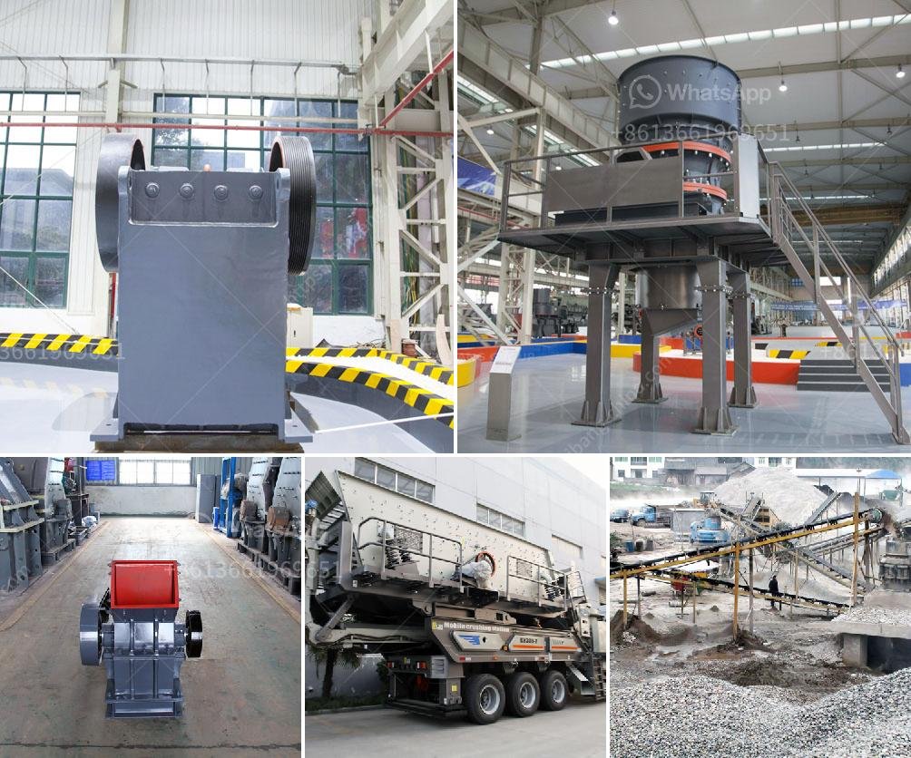

<h3>portable hammer mill australia in perth</h3>
The demand for sustainable and efficient agricultural equipment is on the rise in Australia, and portable hammer mills have become an appealing option for farmers in Western Australia. With their ability to crush and grind a wide range of materials, these versatile machines have proven to be an essential tool for agricultural operations in the region.

One of the leading manufacturers of portable hammer mills in Australia is located in the vibrant city of Perth. With its advanced technology and innovative design, this company has successfully catered to the needs of Australian farmers, offering them practical and mobile solutions for processing feed and grain.

The portable hammer mill comes with several features that make it an ideal choice for farmers in Perth. Its compact size and lightweight design allow for easy transportation between different locations, enabling farmers to bring the mill directly to their fields. This eliminates the need for multiple trips and reduces fuel consumption, providing a cost-effective and time-saving solution.

Another advantage of the portable hammer mill is its versatility. Equipped with high-quality blades and hammers, it can easily crush various materials such as grains, corn, and hay. This flexibility allows farmers to process their own animal feed, ensuring a consistent and nutritious diet for their livestock. Additionally, the mill can be used to grind materials for composting, enabling farmers to effectively recycle agricultural waste and contribute to environmental sustainability.

Furthermore, the portable hammer mill is designed to be user-friendly and low-maintenance. Its simple operation makes it accessible to farmers with varying levels of technical expertise. The mill's robust construction ensures durability and longevity, even when exposed to harsh weather conditions or heavy workload. This reliability gives Australian farmers peace of mind, knowing that they can rely on their equipment to deliver consistent results throughout the years.

Moreover, the portable hammer mill has proven to be an economically viable investment for farmers. By processing their raw materials on-site, farmers can significantly reduce the costs associated with purchasing processed feeds or external grinding services. This not only saves money in the long run but also enhances the overall profitability of their operations.

In conclusion, the portable hammer mill has emerged as an invaluable tool for Australian farmers, particularly those in Perth. Its compact size, versatility, and user-friendly design make it a practical choice for on-site processing of feed and grain. With the added benefits of reducing costs and promoting sustainability, this innovative machine has become a game-changer in the agriculture industry. As the demand for efficient and sustainable equipment continues to grow, portable hammer mills are set to become an indispensable asset for Western Australian farmers.
<h3>Contact us</h3><ul><li><strong>Whatsapp:&nbsp;<a href="https://wa.me/8613661969651">+8613661969651</a></strong></li><li><a href="https://swt.shibang-china.com/?git&amp;zhl&amp;portable hammer mill australia in perth"><strong>Online Service(chat now)</strong></a></li></ul><h3>Related</h3><ul><li><a href='construction conveyor for sale.md'>construction conveyor for sale</a></li><li><a href='hammer mill machinery in namibia.md'>hammer mill machinery in namibia</a></li><li><a href='ykn vibrating screen price.md'>ykn vibrating screen price</a></li><li><a href='jaw crusher for sale in south africa.md'>jaw crusher for sale in south africa</a></li><li><a href='iron ore to iron process made in canada.md'>iron ore to iron process made in canada</a></li></ul>