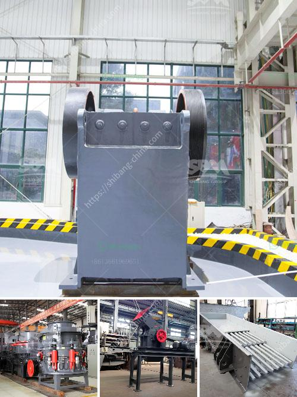

<h3>portable stone crushers</h3>
Portable stone crushers are a convenient way to crush rocks and gravel, making them highly efficient and effective in many construction and mining applications. The need for mobility in any project is increasingly important, and portable stone crushers provide a compact, reliable, and cost-effective solution.

One of the key benefits of portable stone crushers is their flexibility regarding the location where they can be used. This means that the machinery can be driven directly to the construction site or mining area where the raw materials are located, eliminating the need for costly transportation. By reducing the overall transportation cost, portable stone crushers help contractors and miners save both money and time.

Another advantage of portable stone crushers is their ability to handle a wide variety of materials. These machines can crush everything from hard rock to soft rock, from limestone to granite, and everything in between. By providing a mobile solution, these crushers allow the material to be processed directly on site, without the need for additional crushing or screening equipment.

Furthermore, portable stone crushers are very easy to set up and dismantle, eliminating the need for complex installation procedures or heavy machinery. This makes them ideal for projects that require frequent relocation, as they can easily be moved from one site to another. The quick and easy setup also means that the crushers can be operational in a short amount of time, allowing for immediate use and production.

In terms of performance, portable stone crushers are highly efficient and powerful. They are equipped with robust crushers that are capable of handling large amounts of material, ensuring high productivity and maximum output. Additionally, these machines often feature adjustable settings, allowing the user to customize the size of the final product.

The portable stone crushers also come with a range of safety features, ensuring the protection of both the operator and the equipment. This includes features such as automatic overload protection, which prevents damage to the crusher in case of an excessive load. Additionally, these crushers are equipped with safety devices that prevent any unauthorized access to the moving parts.

In conclusion, portable stone crushers offer numerous advantages for construction and mining projects. Their mobility, versatility, and ease of use make them an essential tool for transporting, crushing, and processing various materials. Whether it's a small construction project or a large mining operation, these crushers provide a reliable and cost-effective solution. The ability to move them easily from one location to another, combined with their efficient performance, makes portable stone crushers a valuable asset for any project.
<h3>Contact us</h3><ul><li><strong>Whatsapp:&nbsp;<a href="https://wa.me/8613661969651">+8613661969651</a></strong></li><li><a href="https://swt.shibang-china.com/?git&amp;zhl&amp;portable stone crushers"><strong>Online Service(chat now)</strong></a></li></ul><h3>Related</h3><ul><li><a href='price of grinding machine.md'>price of grinding machine</a></li><li><a href='concrete crushing for sale germany.md'>concrete crushing for sale germany</a></li><li><a href='cost of set up mini cement plant in india.md'>cost of set up mini cement plant in india</a></li><li><a href='japan directory of mobile crushing plant.md'>japan directory of mobile crushing plant</a></li><li><a href='project report granite cutting file.md'>project report granite cutting file</a></li></ul>