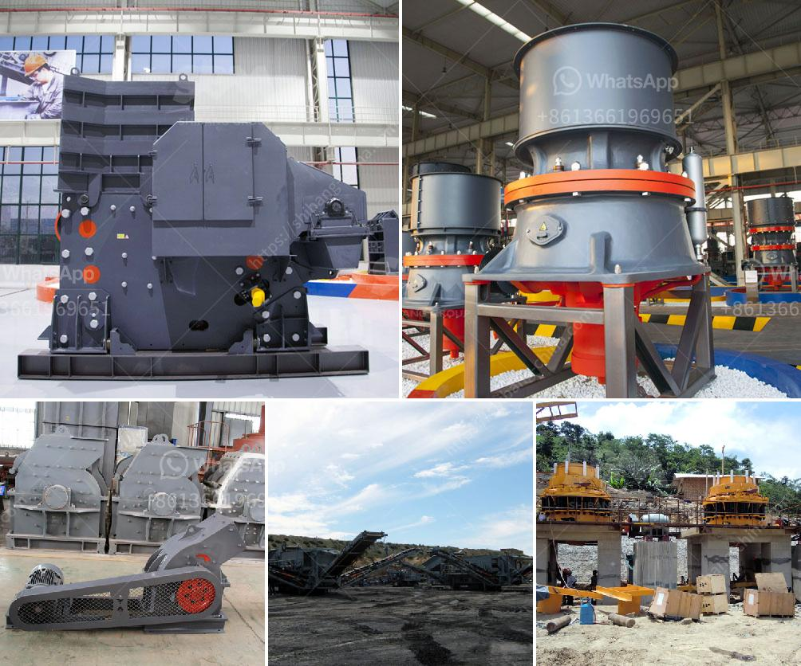

<h3>portable track mounted mini jaw crusher</h3>
The jaw crusher is a kind of crude crushing equipment widely used at home and abroad. It mainly applies for primary and crude crushing of all kinds of hard rocks and block materials. Mini jaw crusher refers to its feed port size of 250*400mm, used mainly for metallurgical, mining, chemical, cement, construction, refractory materials and ceramics industries, as well as crushing various soft and hard ores with a compressive strength of 350MPa or less.

Portable track mounted mini jaw crusher is widely used in road & bridge construction, metallurgy and other fields to crusher and screen. Portable track mounted mini jaw crusher specially adopts jaw crusher as the core minerals crushing equipment. Among all these mobile crusher plants, mobile jaw crusher plant is particularly suitable for hard rock crushing, such as taconite, granite, dark rock, corundum, Silicon carbide and quartzite, etc. 

The unique design concept makes this series crusher achieve perfect combination between crushing efficiency and operating cost. Meanwhile, it has a wide range of application, particularly is suitable for hard rock crushing, such as taconite, granite, dark rock, corundum, Silicon carbide and quartzite, etc. This portable track mounted mini jaw crusher is widely used in mining, smelting, building materials, roads, railways, water conservancy and chemical industries.

1. It adopts ship form steel structure and low vehicle chassis with light weight. The volume is controlled reasonably. Hidden style traction frame is easy to be packed up and put up. The transportation turning radius is very small.

2. Feeding guard is lifted by hydraulic pressure, easy to be loaded and unloaded, conveniently and reliably to be fixed.

3. Humanization design jaw crusher adopts an integrated motor base design with the base fixed directly on the crusher subject to no base fabrication in advance, which has reduced the installation space and simultaneously achieve more stable power transmission.

In conclusion, portable track mounted mini jaw crusher has been a popular choice for many construction companies. They have made it practical to crush difficult materials and reduce the amount of material used in construction sites. This is beneficial to both the construction companies and the environment. With the advantages of mobility and flexibility, portable track mounted mini jaw crusher provides an efficient solution for construction waste disposal and is an ideal equipment for urban construction.
<h3>Contact us</h3><ul><li><strong>Whatsapp:&nbsp;<a href="https://wa.me/8613661969651">+8613661969651</a></strong></li><li><a href="https://swt.shibang-china.com/?git&amp;zhl&amp;portable track mounted mini jaw crusher"><strong>Online Service(chat now)</strong></a></li></ul><h3>Related</h3><ul><li><a href='famous manganese cone crusher parts made china.md'>famous manganese cone crusher parts made china</a></li><li><a href='hand operated rock crusher.md'>hand operated rock crusher</a></li><li><a href='vertical roller mill animation gif.md'>vertical roller mill animation gif</a></li><li><a href='kenya mobile crusher.md'>kenya mobile crusher</a></li><li><a href='slag grinding mill india.md'>slag grinding mill india</a></li></ul>