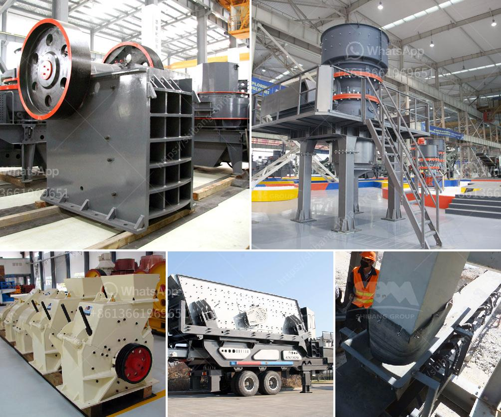

<h3>portable vibrating coal screen</h3>
In today's fast-paced world, innovation plays a vital role in transforming various sectors. The mining industry is no exception, as technological advancements continue to revolutionize the way we extract valuable resources from the earth. One such innovation is the portable vibrating coal screen, which has emerged as a game-changer in coal mining operations.

Coal, being one of the most widely used fossil fuels globally, provides a significant portion of the world's energy needs. The process of extracting coal involves various stages, including mining, transportation, and processing. Traditionally, coal screening involved stationary screens placed at strategic locations within the mining site. However, the advent of portable vibrating coal screens has brought about a paradigm shift in the industry.

The portable vibrating coal screen offers unparalleled convenience and efficiency. Unlike stationary screens, these innovative devices can be easily transported to different mining sites, reducing the need for additional screening infrastructure. This portability ensures that coal mining operations can be conducted effortlessly in diverse geographical locations, saving both time and resources.

The main advantage of portable vibrating coal screens lies in their ability to effectively separate coal particles based on size. The screen consists of multiple layers of mesh with varying aperture sizes. When the coal is fed into the screen, it vibrates vigorously, causing smaller particles to fall through the smaller apertures, while larger particles are carried forward and discharged separately.

This process of separation is essential for coal processing, as it ensures that only coal of the desired size makes it further down the production line. By removing impurities and unwanted particles, the portable vibrating coal screen maximizes the quality and efficiency of the final product. This 'scalping' process ensures that the coal is suitable for its intended purpose, be it electricity generation or industrial use.

The benefits of portable vibrating coal screens extend beyond their portability and efficient screening capabilities. Due to their compact design, these screens occupy minimal space, optimizing the use of available land in mining sites. Additionally, their low maintenance requirements and high durability make them a cost-effective solution for coal mining operations.

Another significant advantage of portable vibrating coal screens is their compatibility with other mining equipment. They seamlessly integrate with crushers, conveyors, and other essential machinery used in the coal mining process. This compatibility ensures a smooth workflow and eliminates the need for time-consuming manual labor, thereby increasing productivity and reducing operational costs.

The portable vibrating coal screen has opened up new possibilities for coal miners worldwide. Its versatility and efficiency have transformed the way coal is extracted, processed, and delivered. By streamlining the screening process, this innovative technology enhances productivity, reduces waste, and optimizes the overall coal mining operation.

In conclusion, the portable vibrating coal screen has emerged as a game-changer in the coal mining industry. Its portability, efficiency, and compatibility with other mining equipment make it a valuable asset for any coal mining operation. As the demand for coal continues to rise, embracing technological advancements like the portable vibrating coal screen becomes crucial not only to improve productivity but also to minimize the environmental impact of coal mining operations.
<h3>Contact us</h3><ul><li><strong>Whatsapp:&nbsp;<a href="https://wa.me/8613661969651">+8613661969651</a></strong></li><li><a href="https://swt.shibang-china.com/?git&amp;zhl&amp;portable vibrating coal screen"><strong>Online Service(chat now)</strong></a></li></ul><h3>Related</h3><ul><li><a href='used heavy duty jaw crushing machine.md'>used heavy duty jaw crushing machine</a></li><li><a href='used crusher for sale in jamaica.md'>used crusher for sale in jamaica</a></li><li><a href='quarry machine manufacturers.md'>quarry machine manufacturers</a></li><li><a href='stone crusher machine sale nederland.md'>stone crusher machine sale nederland</a></li><li><a href='sand washing machine in ethiopia.md'>sand washing machine in ethiopia</a></li></ul>