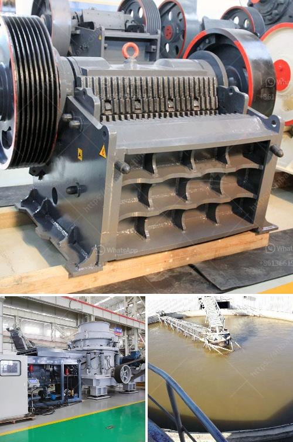

<h3>precio trituradora de tierras en pakistan</h3>
La trituradora de tierras es una herramienta esencial en la construcción y la agricultura. En el caso de Pakistán, un país con una gran dependencia de la agricultura y una creciente industria de la construcción, el costo de una trituradora de tierras es un factor crucial a tener en cuenta. En este artículo, exploraremos los precios de las trituradoras de tierras en Pakistán.

El precio de una trituradora de tierras puede variar dependiendo de varios factores, como la marca, el tamaño y la capacidad de la máquina. También puede haber diferencias en los precios según la región y el distribuidor. En general, las trituradoras de tierras en Pakistán tienen un rango de precios que va desde los 20,000 hasta los 100,000 rupias paquistaníes.

Las trituradoras de tierras más pequeñas, con capacidades de trituración más bajas, tienden a ser más económicas. Estas trituradoras son ideales para proyectos de jardinería y pequeñas obras de construcción. Tienen un precio que oscila entre los 20,000 y los 40,000 rupias paquistaníes.

Por otro lado, las trituradoras de tierras más grandes, con capacidades de trituración más altas, son adecuadas para proyectos de construcción más grandes. Estas trituradoras suelen tener un precio que va desde los 60,000 hasta los 100,000 rupias paquistaníes, dependiendo del tamaño y la capacidad de la máquina.

Es importante tener en cuenta que los precios mencionados son solo estimaciones y pueden variar según la marca y el distribuidor. Además, es necesario tener en cuenta los costos adicionales, como el transporte y la instalación de la trituradora de tierras, que pueden aumentar el costo total.

Al buscar una trituradora de tierras en Pakistán, es recomendable realizar una investigación exhaustiva y comparar precios y características de diferentes marcas y distribuidores. También puede ser útil leer reseñas y opiniones de otros usuarios para obtener una perspectiva realista sobre la calidad y el rendimiento de la trituradora.

Además del precio, es importante considerar otros factores al seleccionar una trituradora de tierras. La durabilidad y la calidad de construcción son características esenciales a tener en cuenta. También es útil buscar una trituradora que ofrezca una garantía para proteger su inversión.

En resumen, el precio de una trituradora de tierras en Pakistán varía según la marca, el tamaño y la capacidad de la máquina. Es importante realizar una investigación exhaustiva, comparar precios y características, y tener en cuenta otros factores, como la calidad y la garantía, antes de tomar una decisión de compra.
<h3>Contact us</h3><ul><li><strong>Whatsapp:&nbsp;<a href="https://wa.me/8613661969651">+8613661969651</a></strong></li><li><a href="https://swt.shibang-china.com/?git&amp;zhl&amp;precio trituradora de tierras en pakistan"><strong>Online Service(chat now)</strong></a></li></ul><h3>Related</h3><ul><li><a href='gypsum board manufacturing factory in turkey.md'>gypsum board manufacturing factory in turkey</a></li><li><a href='list of equipments for a quarry crusher.md'>list of equipments for a quarry crusher</a></li><li><a href='best marble grinder mill.md'>best marble grinder mill</a></li><li><a href='150 tph mobile jaw crusher for sale in malaysia.md'>150 tph mobile jaw crusher for sale in malaysia</a></li><li><a href='brick machine manufacturers south africa.md'>brick machine manufacturers south africa</a></li></ul>