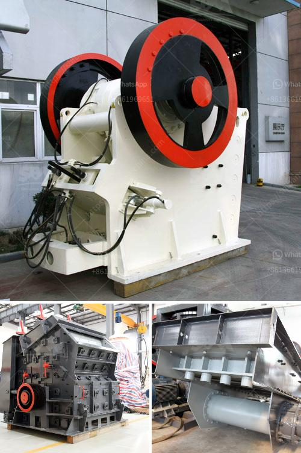

<h3>precipitated calcium carbonate manufacturing machinery</h3>
Calcium carbonate is a chemical compound represented by the chemical formula CaCO3. It is a common substance found in rocks as the minerals calcite and aragonite and is the main component of pearls, coral, and the shells of marine organisms, snails, and eggs.

Precipitated calcium carbonate (PCC) is produced through a chemical precipitation process that utilizes calcium hydroxide (Ca(OH)2) and a high-quality calcium carbonate as raw materials. The production of PCC involves complex reactions and requires advanced machinery to ensure optimal manufacturing efficiency and product quality.

The manufacturing process of PCC machinery involves several steps. First, calcium oxide (also known as quicklime) is obtained by heating limestone in a lime kiln. This calcium oxide is then slaked (reacted with water) to produce calcium hydroxide. The calcium hydroxide is then reacted with a finely-ground, high-grade calcium carbonate to precipitate the PCC.

The production of PCC machinery can be divided into two main methods: the carbonation process and the lime-soda process. The carbonation process uses carbon dioxide gas as the reactant, which is often obtained as a byproduct from other industrial processes. The lime-soda process, on the other hand, uses soda ash (sodium carbonate) as the reactant in addition to calcium hydroxide.

To manufacture PCC machinery, various types of equipment are required. This includes reactors, mixers, filters, centrifuges, and dryers. Each piece of machinery plays a crucial role in the different steps of the manufacturing process.

Reactors are used to carry out the chemical reactions involved in the precipitation process. They ensure the proper mixing and reaction between calcium hydroxide and the calcium carbonate raw materials. The temperature, pressure, and pH levels within the reactors are carefully controlled to optimize the formation of PCC particles.

Mixers are used to thoroughly mix the reactants and maintain a uniform suspension during the reaction process. They ensure that the calcium hydroxide and calcium carbonate are evenly distributed, enhancing the efficiency of the reaction.

Filters are used to separate the solid PCC particles from the liquid and remove any impurities. The filters maintain the desired particle size distribution and prevent the formation of agglomerates.

Centrifuges are used for further separation and drying of the PCC particles. They separate the liquid phase from the solid phase by using centrifugal force, enabling the recovery of the PCC particles for subsequent processing.

Drying equipment is used to remove moisture from the PCC particles, reducing their moisture content to the desired level. This ensures the stability of the product and prevents any potential degradation during storage or transportation.

In recent years, advancements in technology have led to the development of more efficient and automated machinery for the manufacturing of PCC. These advancements have enabled increased production capacities, improved product quality, and reduced production costs.

The precipitated calcium carbonate manufacturing machinery plays a critical role in the production process, ensuring the efficient production of high-quality PCC. As the demand for PCC continues to grow in various industries, such as paper, plastics, paint, and construction, the need for advanced and reliable machinery will also increase.

In conclusion, the manufacturing of precipitated calcium carbonate involves complex reactions and requires specialized machinery for optimal efficiency and product quality. The use of reactors, mixers, filters, centrifuges, and dryers is crucial in achieving the desired PCC particles. Advancements in technology have led to the development of more efficient and automated machinery, meeting the increasing demand for PCC in various industries.
<h3>Contact us</h3><ul><li><strong>Whatsapp:&nbsp;<a href="https://wa.me/8613661969651">+8613661969651</a></strong></li><li><a href="https://swt.shibang-china.com/?git&amp;zhl&amp;precipitated calcium carbonate manufacturing machinery"><strong>Online Service(chat now)</strong></a></li></ul><h3>Related</h3><ul><li><a href='ball mill in egypt.md'>ball mill in egypt</a></li><li><a href='conveyor belts in opracion.md'>conveyor belts in opracion</a></li><li><a href='simple stone crusher dubai.md'>simple stone crusher dubai</a></li><li><a href='feeding stone crushers.md'>feeding stone crushers</a></li><li><a href='mini crusher for gravel sale in philippines.md'>mini crusher for gravel sale in philippines</a></li></ul>