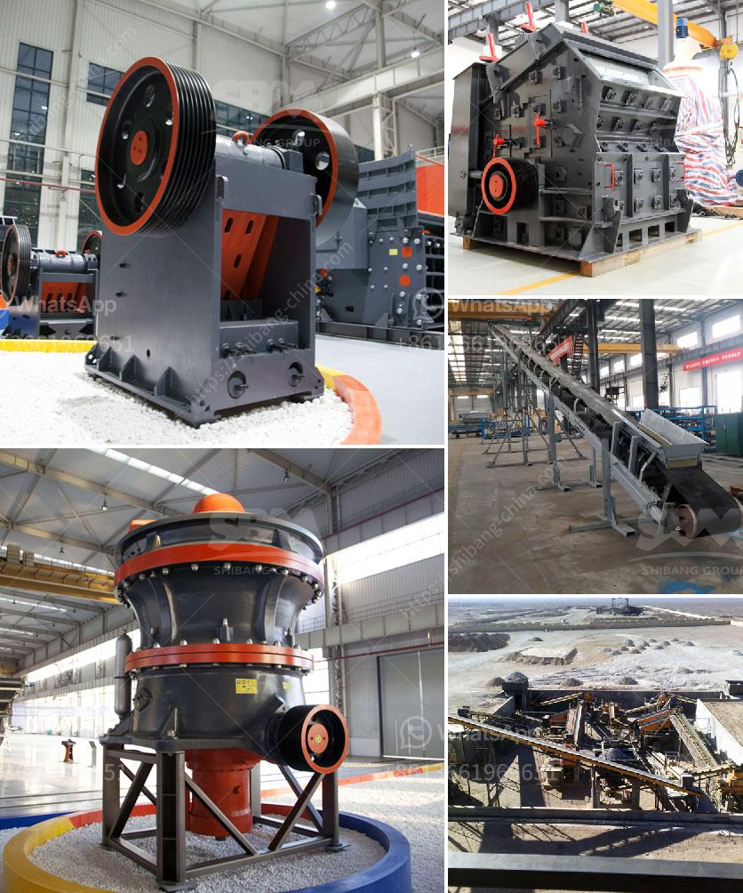

<h3>precipitated calcium carbonate milling</h3>
Calcium carbonate, with its chemical formula CaCO3, is a vital mineral used in various industries such as construction, agriculture, and pharmaceuticals. It is commonly found in rocks and minerals all over the world. However, obtaining high-quality calcium carbonate for industrial use requires advanced milling techniques, and one such innovative method is the process of precipitated calcium carbonate (PCC) milling.

PCC milling involves a series of steps to produce a fine powder of calcium carbonate with unique properties such as high brightness and controlled particle size distribution. This process begins with limestone, a sedimentary rock containing calcium carbonate, which is initially crushed into small particles. The crushed limestone is then transported to a lime kiln, where it is heated to high temperatures to produce quicklime (calcium oxide).

The next crucial step in the PCC milling process is the reaction of quicklime with water to produce slaked lime (calcium hydroxide). This reaction, known as hydration, occurs in a controlled manner to ensure the formation of pure and high-quality calcium hydroxide. The slaked lime is then further processed to remove impurities and obtain a homogeneous suspension known as milk of lime.

The milk of lime undergoes carbonation, where carbon dioxide gas is passed through the suspension. This reaction between calcium hydroxide and carbon dioxide results in the precipitation of fine particles of calcium carbonate. The size and shape of these particles can be controlled by adjusting various parameters such as temperature, pressure, and concentration of reagents.

Once the precipitation is complete, the resulting slurry of calcium carbonate is dewatered and dried to obtain a solid material. This material is then subjected to milling, where it undergoes size reduction to achieve the desired particle size distribution. The milling process ensures that the particles are finely ground and have a consistent size, which is essential for their subsequent use in various industrial applications.

Precipitated calcium carbonate milling offers several advantages over other traditional milling methods. Firstly, the controlled precipitation ensures the production of a pure and high-quality calcium carbonate, free from impurities that may affect its performance in different applications. Secondly, the fine particle size distribution achieved through milling allows for better dispersion and uniform blending with other ingredients in a formulation.

Moreover, the high brightness of precipitated calcium carbonate makes it suitable for industries such as paper, paint, and plastics, where a superior white appearance is desired. The controlled particle size also contributes to improved optical properties and enhanced performance in applications such as fillers, coatings, and pigments.

In conclusion, the milling of precipitated calcium carbonate is a revolutionary process that utilizes advanced techniques to produce a high-quality and versatile mineral. This innovative method ensures the particles are finely ground, have a consistent size, and exhibit superior properties compared to traditional milling methods. With its broad range of applications, including construction, agriculture, and pharmaceuticals, precipitated calcium carbonate is undoubtedly a valuable mineral and a game-changer in the world of milling.
<h3>Contact us</h3><ul><li><strong>Whatsapp:&nbsp;<a href="https://wa.me/8613661969651">+8613661969651</a></strong></li><li><a href="https://swt.shibang-china.com/?git&amp;zhl&amp;precipitated calcium carbonate milling"><strong>Online Service(chat now)</strong></a></li></ul><h3>Related</h3><ul><li><a href='copper processing plant.md'>copper processing plant</a></li><li><a href='quartz sand particle size quartz powder.md'>quartz sand particle size quartz powder</a></li><li><a href='second hand crushers and screens in south africa.md'>second hand crushers and screens in south africa</a></li><li><a href='kenya hammer mill is manufactured.md'>kenya hammer mill is manufactured</a></li><li><a href='400 tph mobile coal crusher plant manufacturer.md'>400 tph mobile coal crusher plant manufacturer</a></li></ul>