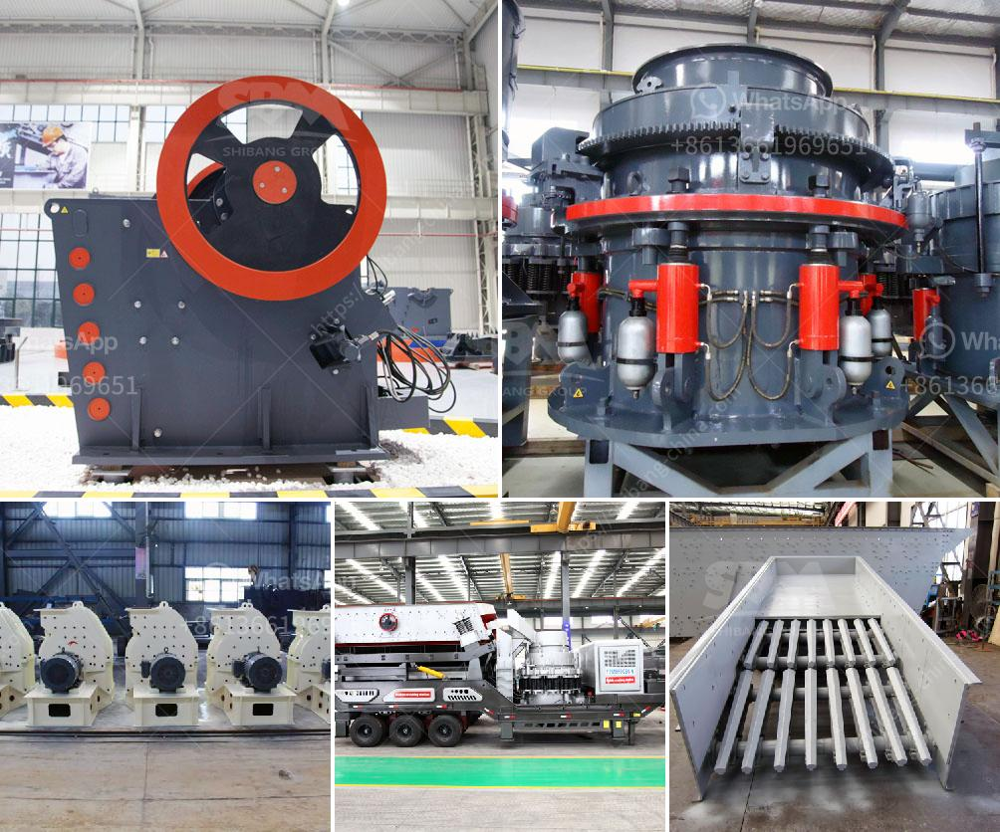

<h3>precipitated calcium carbonate plant in bangladesh</h3>
The construction industry in Bangladesh has been flourishing over the past decade, driven by rapid urbanization and extensive infrastructure development. To meet the escalating demand for construction materials, the country has been focusing on increasing local production capacity. One essential material, precipitated calcium carbonate (PCC), has gained significant attention due to its various applications, particularly in the construction sector. This article explores the establishment of a PCC plant in Bangladesh, discussing its significance and potential benefits for the national economy.

Precipitated calcium carbonate (PCC) is a versatile, finely ground white powder with exceptional physical and chemical properties. It is primarily used as a filler and coating material in a range of industries, including construction, paint, paper, plastic, and rubber. PCC exhibits excellent brightness, opacity, and whiteness, making it a preferred choice for enhancing the visual appearance and performance of various products.

Bangladesh has experienced unprecedented growth in its construction sector, thanks to ambitious infrastructure projects, urbanization, and the rising buying power of its citizens. The construction industry demands a substantial amount of building materials to meet the demand for new residential and commercial structures. PCC offers significant advantages, as it can replace or reduce the use of traditional materials like limestone, marble, and chalk, which tend to be costly and less efficient in construction applications.

1. Cost-effectiveness: The establishment of a PCC plant in Bangladesh would significantly reduce the country's reliance on imported PCC, resulting in cost-effectiveness for the construction industry. Local production would ensure a stable supply chain with reduced transportation costs and import duties, thereby offering competitive prices to consumers.

2. Employment opportunities: Setting up a PCC plant would generate numerous job opportunities, both directly and indirectly. From plant operation and maintenance to support services, there would be a need for skilled and unskilled labor, resulting in improved livelihoods for many Bangladeshis.

3. Sustainability and environmental impact: PCC production is known for its minimal environmental impact compared to traditional calcium carbonate sources. The plant would adhere to international best practices, adopting energy-efficient technologies and minimizing water consumption and waste generation. Moreover, utilizing PCC instead of conventional materials would contribute to the conservation of natural resources.

4. Product quality and innovation: Domestic production of PCC would allow greater control over the product quality, ensuring it meets specific standards and requirements of the local market. Additionally, the presence of a PCC plant would encourage research and development, promoting innovation and the introduction of environmentally friendly alternatives for various applications.

The establishment of a precipitated calcium carbonate (PCC) plant in Bangladesh would mark a significant milestone in the country's construction industry and economy. With its versatile nature and wide-ranging applications, PCC offers cost-effective, sustainable, and high-quality alternatives to conventional materials. The availability of locally produced PCC would not only boost the construction sector but also create job opportunities, reduce reliance on imports, and contribute to environmental preservation.

As Bangladesh continues to witness an era of rapid infrastructure development, the introduction of a PCC plant would strengthen the country's position as a self-sufficient and sustainable player in the global construction materials market.
<h3>Contact us</h3><ul><li><strong>Whatsapp:&nbsp;<a href="https://wa.me/8613661969651">+8613661969651</a></strong></li><li><a href="https://swt.shibang-china.com/?git&amp;zhl&amp;precipitated calcium carbonate plant in bangladesh"><strong>Online Service(chat now)</strong></a></li></ul><h3>Related</h3><ul><li><a href='crushing b vsi crusher.md'>crushing b vsi crusher</a></li><li><a href='crusher unit daily production capacity.md'>crusher unit daily production capacity</a></li><li><a href='cement clinker processing machine.md'>cement clinker processing machine</a></li><li><a href='belt conveyor manufacturers in indonesia.md'>belt conveyor manufacturers in indonesia</a></li><li><a href='limestone rock crushing company.md'>limestone rock crushing company</a></li></ul>