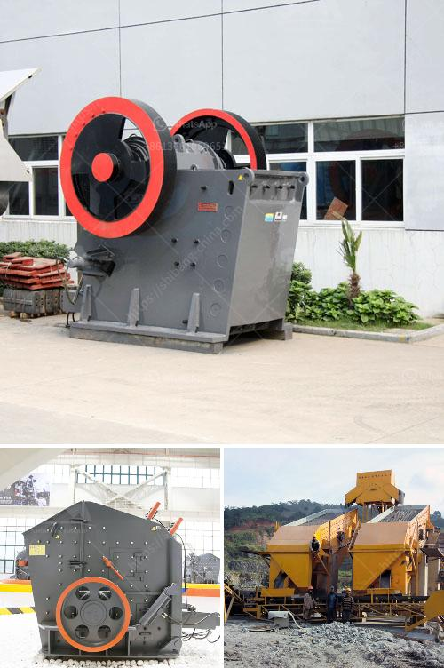

<h3>price list for belt conveyor pdf</h3>
A belt conveyor is a mechanical handling equipment that transports materials from one location to another. It is commonly used in industries such as mining, agriculture, manufacturing, and packaging. Before investing in a belt conveyor system, it's essential to consider the price list to determine the most suitable option for your business.

The price of a belt conveyor system depends on various factors, including its size, capacity, speed, and material handling requirements. A typical price list for belt conveyors ranges from $1000 to $3000 per linear foot, depending on the length and complexity of the system. Additional costs may include installation, maintenance, and customization to meet specific needs.

It is crucial to consider the quality and durability of the belt conveyor system when reviewing the price list. Investing in a reliable and robust system ensures smooth operations, minimizes downtime, and reduces long-term maintenance costs. High-quality conveyors may come at a higher price initially but offer a better return on investment in the long run.

Other factors that influence the price include the belt material and construction. Conveyors with belts made from materials like rubber, PVC, or steel may vary in their costs. Similarly, the construction of the frame, rollers, and other components can affect the overall price.

To find the best price for a belt conveyor, it is recommended to consult reputable suppliers and manufacturers who offer a variety of options. Compare prices, features, and warranties to ensure you get the most value for your investment. Additionally, consider the supplier's reputation for customer service, installation support, and after-sales maintenance.

In conclusion, when considering a belt conveyor system, reviewing the price list is essential. Take into account the size, capacity, speed, and materials required for your application. Consider the quality, durability, and overall value offered by suppliers. By carefully evaluating all these factors, you can make an informed decision, ensuring the smooth and efficient transportation of materials within your business.
<h3>Contact us</h3><ul><li><strong>Whatsapp:&nbsp;<a href="https://wa.me/8613661969651">+8613661969651</a></strong></li><li><a href="https://swt.shibang-china.com/?git&amp;zhl&amp;price list for belt conveyor pdf"><strong>Online Service(chat now)</strong></a></li></ul><h3>Related</h3><ul><li><a href='malaysia coconut grinder machine.md'>malaysia coconut grinder machine</a></li><li><a href='ballast processing.md'>ballast processing</a></li><li><a href='list of crusher plant.md'>list of crusher plant</a></li><li><a href='size of input and output of primary crusher.md'>size of input and output of primary crusher</a></li><li><a href='silica sand crushing plant in pakistan.md'>silica sand crushing plant in pakistan</a></li></ul>