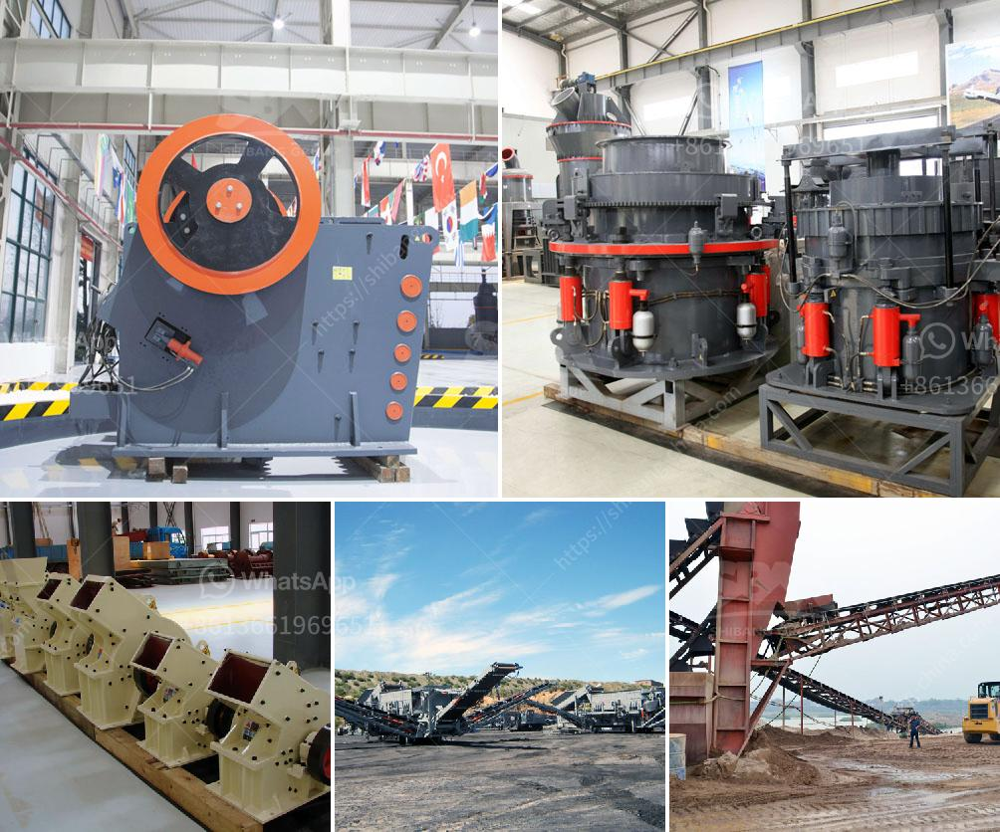

<h3>price list of granite crusher</h3>
Granite is a common type of igneous rock that is granular in texture. Due to its high durability and aesthetic qualities, it is widely used for both residential and commercial purposes. Granite crusher is a type of stone crusher that is used to crush granite into smaller pieces by the process of crushing. Consequently, it is typically used in a variety of construction and landscaping projects.

When considering the price of a granite crusher, there are several factors that affect the final cost. These factors include the size and capacity of the crusher, the type of granite being crushed, and the overall complexity of the crushing process. Additionally, the location and accessibility of the granite quarry, as well as transportation costs, can also influence the price.

The size and capacity of the granite crusher are essential factors to consider. A larger crusher will typically have a higher price, as it can handle more significant quantities of granite and operate more efficiently. However, the specific requirements of each project should be taken into account to determine the most appropriate size and capacity.

The type of granite being crushed also affects the price. Some types of granite are more valuable and sought after due to their scarcity or unique characteristics. High-quality and exotic granite varieties will generally have a higher price compared to more common types of granite. Additionally, customized granite crushers designed for specific types of granite may incur additional costs.

The complexity of the crushing process is another crucial factor in determining the price of a granite crusher. A more advanced and automated crushing process may require a higher initial investment, leading to a higher price. However, it is important to consider the potential long-term cost savings resulting from increased efficiency and reduced maintenance.

The location and accessibility of the granite quarry also affect the price of a granite crusher. If the quarry is located far from the area where the crusher is required, transportation costs may increase significantly. Similarly, if the quarry is in a remote or inaccessible location, additional expenses may be incurred to transport the granite to the crusher.

It is essential to consider the overall cost-effectiveness of a granite crusher. While the initial price may be a significant factor, it is equally important to evaluate the durability, reliability, and maintenance requirements of the crusher. Investing in a high-quality and efficient granite crusher may result in long-term cost savings by reducing downtime and repair expenses.

In conclusion, the price of a granite crusher is influenced by various factors, including the size and capacity of the crusher, the type of granite being crushed, and the complexity of the crushing process. The location and accessibility of the granite quarry, as well as transportation costs, also play a role in determining the final price. It is crucial to consider the specific requirements of each project and to evaluate the long-term cost-effectiveness when selecting a granite crusher.
<h3>Contact us</h3><ul><li><strong>Whatsapp:&nbsp;<a href="https://wa.me/8613661969651">+8613661969651</a></strong></li><li><a href="https://swt.shibang-china.com/?git&amp;zhl&amp;price list of granite crusher"><strong>Online Service(chat now)</strong></a></li></ul><h3>Related</h3><ul><li><a href='component of ball mill and its working principle.md'>component of ball mill and its working principle</a></li><li><a href='m sand manufacturers in india.md'>m sand manufacturers in india</a></li><li><a href='price on a mining ball mill 10 tons per hour.md'>price on a mining ball mill 10 tons per hour</a></li><li><a href='south africa coal mining cost per ton.md'>south africa coal mining cost per ton</a></li><li><a href='stone grinding mills in pakistan.md'>stone grinding mills in pakistan</a></li></ul>