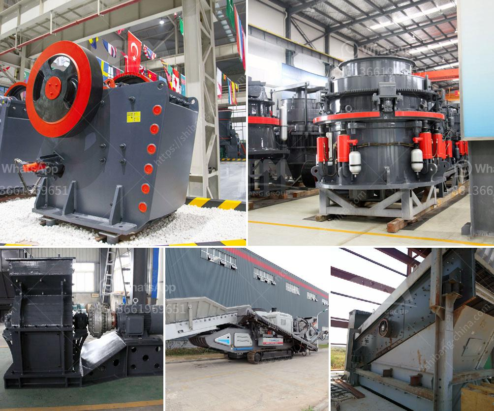

<h3>price list of used stone crusher in india</h3>
Stone crushing industry in India is an important industrial sector in the country engaged in producing crushed stone of different sizes according to the requirement which used as raw material for various construction activities such as construction of roads, highways, bridges, buildings, and canals etc. 

It is estimated that there are over 12,000 stone crusher units in India. The number is expected to grow further keeping in view the future plans for development of infrastructure of roads, canals and buildings that are required for overall development of the country. In India, the Stone Crushing Industry sector is estimated to have an annual turnover of Rs. 5000 crore (equivalent to over US$ 1 billion) and is therefore an economically important sector. The sector is estimated to be providing direct employment to over 500,000 people engaged in various activities such as mining, crushing plant, transportation of mined stones and crushed products etc. 

Stone crushers are used to crush big stones and leftover materials turning them into usable aggregates. They are mainly used to produce crushed stone and aggregate, through the mining process they are usually used to make cement, asphalt, and other building materials. Construction sites and quarries are the preferred location for mobile crushers. 

There are different types of used stone crushers in India. There are also portable cone crusher for rock processing. There are different types of small crushing projects all over India. SBM provides complete range of crusher machine for sale. Stone crusher plant cost in India is reasonable for large and small scale stone crushing operations. 

The mining industry in India is a major economic activity which contributes significantly to the economy of India. Along with 48.83% arable land, India has significant sources of coal, bauxite, titanium ore, chromite, natural gas, diamonds, petroleum, and limestone. India is the largest producer of mica, the third-largest producer of iron ore, and the fifth-largest producer of bauxite in the world. 

India's metal and mining industry was estimated to be $106.4 billion in 2010. However, the mining in India is also infamous for human rights violations and environmental pollution. The industry has been hit by several high-profile mining scandals in recent times. Huge quantities of acidic water containing arsenic, copper, and zinc (amongst other metallic ions) are discharge into nearby rivers causing environmental pollution. 

Small size stone crushers are primarily small scale industries in early time, mostly owned and operated by less educated individuals and are scattered all over the country. These crushers are designed to provide high productivity in a less time frame. 

Used stone crusher price in India is second hand stone crushing machine with low price for sale in Europe, Africa and Asia etc. Theused machinery is with low price and excellent performance, also with long life after sale service. It is the best choice for small or temporary crushing projects. +
<h3>Contact us</h3><ul><li><strong>Whatsapp:&nbsp;<a href="https://wa.me/8613661969651">+8613661969651</a></strong></li><li><a href="https://swt.shibang-china.com/?git&amp;zhl&amp;price list of used stone crusher in india"><strong>Online Service(chat now)</strong></a></li></ul><h3>Related</h3><ul><li><a href='roller mill dimensions.md'>roller mill dimensions</a></li><li><a href='aggregate crushing machines.md'>aggregate crushing machines</a></li><li><a href='start up procedure for ball mill.md'>start up procedure for ball mill</a></li><li><a href='granite stone crushing machine.md'>granite stone crushing machine</a></li><li><a href='distributor jaw crusher merk khong chuan.md'>distributor jaw crusher merk khong chuan</a></li></ul>