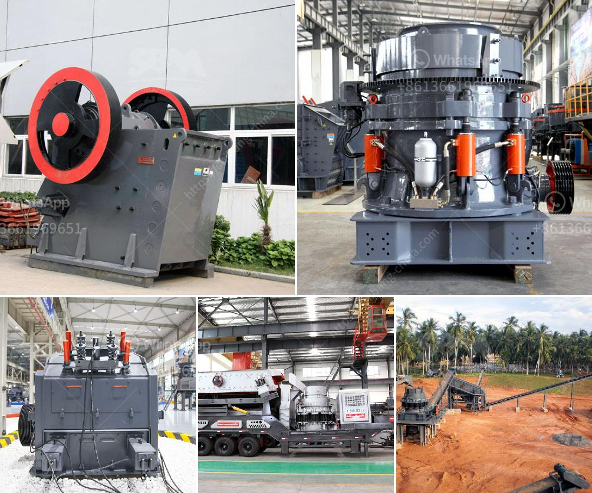

<h3>price list sag mill for sale</h3>
A SAG mill, also known as a semi-autogenous grinding mill, is a versatile grinding machine that utilizes steel balls as grinding media for reducing solid ore particles to smaller sizes. This grinding equipment is extensively used in mineral processing applications for its efficiency in breaking down ores for further processing. If you are in the market for a sag mill, this article unveils the price list sag mill for sale, offering a comprehensive overview of the available options within the 300-500-word range.

When searching for a sag mill, it is crucial to consider several factors to ensure you make an informed decision. Firstly, the mill's construction material determines its durability and performance. The best sag mills are typically made from high-quality steel alloys that can withstand the harsh conditions of grinding ores. Additionally, the sag mill's design and dimensions play a significant role in its efficiency. Opting for a mill with carefully engineered dimensions helps maximize the grinding process, resulting in higher throughput and reduced energy consumption.

Next, let's dive into the price list for sag mills available on the market. The range of 300-500 words provides a glimpse into the diverse options within this price bracket. It is essential to note that the actual prices of sag mills can vary widely based on factors such as size, brand reputation, customization options, and additional features. Prices indicated below are approximate figures and intended for illustrative purposes only.

It is crucial to consult with industry experts and evaluate your specific requirements before finalizing your decision on purchasing a sag mill. Factors such as your operational needs, processing volume, and budget should be taken into account. Furthermore, considering long-term maintenance costs and the availability of spare parts is vital to ensuring the ongoing smooth operation of your mill.

Remember that investing in a high-quality sag mill may require a substantial upfront financial commitment. However, it is a worthwhile investment that can positively impact your mineral processing operations by enhancing efficiency, reducing energy and maintenance costs, and improving overall productivity.

In conclusion, the price list sag mill for sale within the 300-500-word range provides a glimpse into the available options in the market. When considering purchasing a sag mill, assessing factors such as construction material, dimensions, additional features, and warranty support is essential for making an informed decision. Invest your time and effort in research and consultations to identify the ideal sag mill that meets your specific needs and budget, ultimately contributing to the success of your mineral processing operations.
<h3>Contact us</h3><ul><li><strong>Whatsapp:&nbsp;<a href="https://wa.me/8613661969651">+8613661969651</a></strong></li><li><a href="https://swt.shibang-china.com/?git&amp;zhl&amp;price list sag mill for sale"><strong>Online Service(chat now)</strong></a></li></ul><h3>Related</h3><ul><li><a href='types of crushers ppt.md'>types of crushers ppt</a></li><li><a href='ghana quarry crusher.md'>ghana quarry crusher</a></li><li><a href='iron processing plant.md'>iron processing plant</a></li><li><a href='fly ash processing plant machinery.md'>fly ash processing plant machinery</a></li><li><a href='quartz powder plant in india.md'>quartz powder plant in india</a></li></ul>